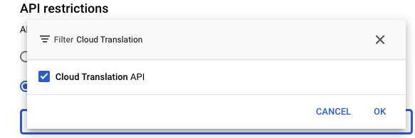
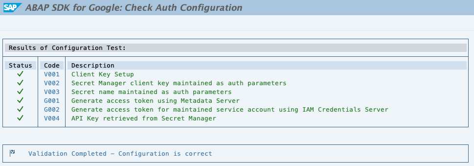

Secret Manager: Quickstart
--------------------------

Many API's which are part of Google Library use API key as a credential for execution. As best practice, we should not embed credentials directly in code or application source tree. The ideal way would be to store them centrally with access restricted to administrators. Storing centrally also means that the application using these credentials need to have an easy way to retrieve them for their functioning.

Google Cloud [Secret Manager](https://cloud.google.com/secret-manager) is a secure and convenient storage system for API keys, passwords, certificates, and other sensitive data. Secret Manager provides a central place and single source of truth to manage, access, and audit secrets across Google Cloud.

ABAP SDK provides an implicit way to connect and use Google Cloud Secret Manager API to store and retrieve secrets. 

This quickstart shows you how to use [Secret Manager API](https://cloud.google.com/secret-manager/docs/overview) to store and retrieve API keys using ABAP SDK and use it to call [Translate AI API](https://cloud.google.com/translate). 

The configuration steps in the quickstart guide assumes that the SAP system is hosted on Google cloud platform. To learn more about authentication step for SAP system hosted outside Google Cloud Platform, please refer to the documentation "[Authenticate using API key stored in Secret Manager](https://cloud.google.com/solutions/sap/docs/abap-sdk/latest/authentication#scm_use_apikey)"

### Before you begin

Before you run this quickstart, make sure that you or your administrators have completed the following prerequisites:

-   You have a Google Cloud account and project. Please keep the Project Id with you which is available in Google Cloud [Dashboard](https://console.cloud.google.com/home/dashboard).

-   Billing is enabled for your project. [See how to confirm that billing is enabled for your project](https://cloud.google.com/billing/docs/how-to/verify-billing-enabled).

### Create a API Key and Save in Secret Manager

#### Enable required services

-   Click Activate Cloud Shell at the top of the [Google Cloud console](https://console.cloud.google.com/home/dashboard) to Open Cloud Shell. We will use the Cloud Shell to run all our commands.


Enable Google Service to be accessed by ABAP SDK (Replace the string PROJECT_ID with your Google Cloud project Id)
```
gcloud auth login
gcloud config set project PROJECT_ID
gcloud services enable iamcredentials.googleapis.com
gcloud services enable secretmanager.googleapis.com
```
#### Create Service Account

Create a Service Account to be used by ABAP SDK and assign it the [Secret Manager Secret Accessor](https://cloud.google.com/iam/docs/understanding-roles?_ga=2.155834226.-877857378.1694462570#secretmanager.secretAccessor) role. (Replace the string `PROJECT_ID` with your Google Cloud project Id)
```
gcloud iam service-accounts create abap-sdk-qs \
    --description="ABAP SDK Quick Start" \
    --display-name="ABAP SDK Quick Start"

gcloud projects add-iam-policy-binding PROJECT_ID \
    --member="serviceAccount:abap-sdk-qs@PROJECT_ID.iam.gserviceaccount.com" \
    --role="roles/secretmanager.secretAccessor" \
    --condition="None"
```

#### Create a API Key

To create API keys using the Google Cloud console, perform the following steps:

1.  In the Google Cloud console, go to the Credentials page:

"[Go to Credentials](https://console.cloud.google.com/apis/credentials)" 

1.  Click Create Credentials and select API key from the menu.

-   The API key created dialog displays the API key string. Copy your key string and keep it secure. You need this API key to configure authentication in SAP.

-   By default, API keys are unrestricted. We recommended that you restrict API keys by selecting the APIs to which this API key can be used. For now please restrict by selecting "Cloud Translation API".


#### Create a Secret to save the API Key

In the Google Cloud console, create a secret with the name `TEST_SECRET`, and store the API key as the latest version.\
[Go to Secret manager](https://console.cloud.google.com/security/secret-manager)

For information about how to create a secret, see [Create a secret](https://cloud.google.com/secret-manager/docs/creating-and-accessing-secrets).

The ABAP SDK for Google Cloud by default retrieves only the latest version of a secret.

### Configure client key for Secret Manager access

The below configuration will be used by the ABAP SDK to connect to the secret manager API.

*  Goto SPRO > ABAP SDK for Google Cloud > Basic Settings > Configure Client Key and add the following new entry. (Replace the string `PROJECT_ID` with your Google Cloud project Id)

| Field Name                             | Value         |
| ------------------------------------   | ------------- |
| **Google Cloud Key Name:**             | CLIENT_KEY_SM |
| **Google Cloud Service Account Name:** | abap-sdk-qs@PROJECT_ID.iam.gserviceaccount.com |
| **Google Cloud Scope:**                | https://www.googleapis.com/auth/cloud-platform |
| **Google Cloud Project Identifier:**   | PROJECT_ID |
| **Authorization Class:**               | /GOOG/CL_AUTH_GOOGLE |

**NOTE** Leave the other fields blank

*  Validate the configuration 'CLIENT_KEY_SM' using SPRO > ABAP SDK for Google Cloud > Utilities > Validate Authentication Configuration.


### Configure client key for the Tanslate API call using API Key

The below configuration will be used by the ABAP SDK to 1) connect to the secret manager API, 2) retrieve the API key stored in the secret 3) connect to the Translate AI API.
* Goto SPRO > ABAP SDK for Google Cloud > Basic Settings > Configure Client Key and add the following new entry. (Replace the string PROJECT_ID with your Google Cloud project Id)

| Field Name                             | Value         |
| ------------------------------------   | ------------- |
| **Google Cloud Key Name:**             | DEMO_TRANSLATE |
| **Google Cloud Service Account Name:** | Leave this field blank. |
| **Google Cloud Scope:**                | https://www.googleapis.com/auth/cloud-platform |
| **Google Cloud Project Identifier:**   | PROJECT_ID |
| **Authorization Class:**               | /GOOG/CL_AUTH_API_KEY_SM |
| **Authorization Parameter 1:**         | CLIENT_KEY_SM --> This is the client key that you've created for Secret Manager access |
| **Authorization Parameter 2:**         | TEST_SECRET → This is the ID of the secret, which has the API key stored |

**NOTE** Leave the other fields blank

* Validate the configuration ‘DEMO_TRANSLATE’ using SPRO > ABAP SDK for Google Cloud > Utilities > Validate Authentication Configuration.


The SDK configuration is now complete, and API keys can be stored and retrieved. These keys can be used to call compatible APIs, such as [Cloud Translation](https://cloud.google.com/translate/docs/overview) and Google Maps API like [Address Validation](https://developers.google.com/maps/documentation/address-validation/overview), [Directions](), [Distance Matrix](https://developers.google.com/maps/documentation/distance-matrix/overview), [Elevation](https://developers.google.com/maps/documentation/elevation/start), [Geocoding](https://developers.google.com/maps/documentation/geocoding/overview), [Places](https://developers.google.com/maps/documentation/places/web-service/overview), [Roads](https://developers.google.com/maps/documentation/roads/overview), and [Time Zones](https://developers.google.com/maps/documentation/timezone/overview).

We can now proceed with a sample invocation of the Cloud Translation v2 API using the API key configuration that is retrieved from Secret Manager.

### Create a program to translate a text

-   Create a program in SE38 and paste the [linked](zr_qs_translate_texts.prog.abap) code, which translates the English sentence to German language. 

-   Note: The Client key used in the program is `DEMO_TRANSLATE` which will be used by the SDK to retrieve the API key stored in the Secret Manager.

### Program to retrieve the secret

Refer to the above example, you can use Secret Manager to store any secrets relevant for your requirement. The SDK can be used to retrieve the secret directly from the secret manager service. The reference code to access a secret version available in this [link](https://cloud.google.com/solutions/sap/docs/abap-sdk/samples/sm-access-secret-version). Try running the code with Client Key as `CLIENT_KEY_SM` and Secret Id as `TEST_SECRET` to retrieve the stored secret.

#### Example Input:
```
   "Open HTTP Connection
      DATA(lo_sm) = NEW /goog/cl_secretmgr_v1( iv_key_name = 'CLIENT_KEY_SM' ).
     
   "Populate relevant parameters for the API call
      lv_p_projects_id = lo_sm->gv_project_id.
      lv_p_secrets_id = 'TEST_SECRET.
      lv_p_versions_id = 'latest'.

   "Call the API method
   CALL METHOD lo_sm->access_versions ....
   ...
```

Happy Learning! and Happy Innovating!