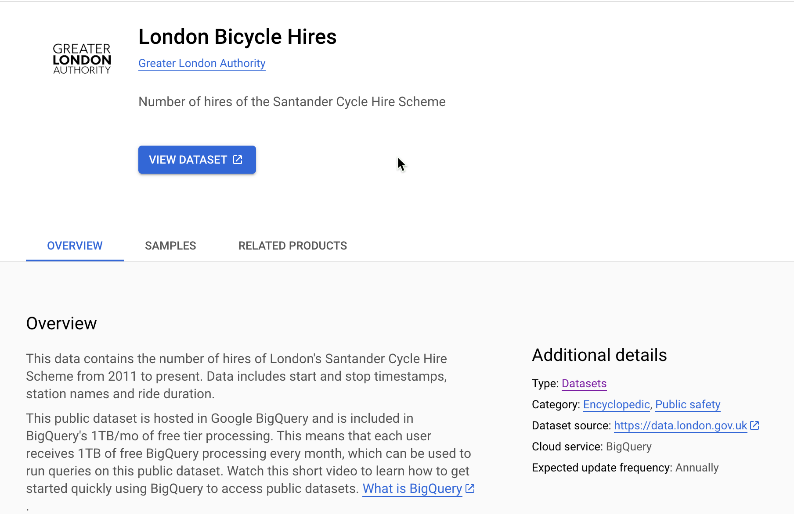

Query data from BigQuery: Quickstart
-------------------------------------------------

### What is BigQuery

BigQuery is a fully-managed, petabyte-scale analytics data warehouse that enables businesses to analyze all their data very quickly and cost-effectively. It is a cloud-based service that does not require any infrastructure to set up or manage, so businesses can focus on finding meaningful insights from their data using GoogleSQL. BigQuery offers flexible pricing models, including on-demand and flat-rate options, so businesses can choose the pricing plan that best suits their needs.

BigQuery is a powerful tool that can be used for a variety of purposes, including:

-   Business intelligence and analytics

-   Data warehousing

-   Data lake management

-   Machine learning and artificial intelligence

-   Real-time analytics

-   Ad hoc analysis

-   Reporting and dashboards

BigQuery is a popular choice for businesses of all sizes, including some of the world's largest companies. It is a reliable and scalable platform that can handle even the most demanding workloads.

If you are looking for a powerful and cost-effective analytics data warehouse, BigQuery is a great option. It is easy to use and offers a wide range of features and capabilities.

You can learn more about by following this [link](https://cloud.google.com/bigquery/docs?hl=en#docs)

### Before you begin

Before you run this quickstart, make sure that you or your administrators have completed the following prerequisites:

-   You have a Google Cloud account and project. Please keep the Project Id with you which is available in Google Cloud [Dashboard](https://console.cloud.google.com/home/dashboard).

-   Billing is enabled for your project. [See how to confirm that billing is enabled for your project](https://cloud.google.com/billing/docs/how-to/verify-billing-enabled).

#### Enable required services

-   Click Activate Cloud Shell at the top of the [Google Cloud console](https://console.cloud.google.com/home/dashboard) to Open Cloud Shell. We will use the Cloud Shell to run all our commands.

-   Enable Google Service to be accessed by ABAP SDK (Replace the string `PROJECT_ID` with your Google Cloud project Id)
```
gcloud auth login
gcloud config set project PROJECT_ID
gcloud services enable iamcredentials.googleapis.com
gcloud services enable bigquery.googleapis.com
```

### Configure client key for BigQuery Access

The below configuration will be used by the ABAP SDK to connect to the BigQuery V2 API.
 
Goto SPRO > ABAP SDK for Google Cloud > Basic Settings > Configure Client Key and add the following new entry. (Replace the string PROJECT_ID with your Google Cloud project Id)

| Field Name                             | Value         |
| ------------------------------------   | ------------- |
| **Google Cloud Key Name:**             | DEMO_BQ |
| **Google Cloud Service Account Name:** | abap-sdk-qs@PROJECT_ID.iam.gserviceaccount.com |
| **Google Cloud Scope:**                | https://www.googleapis.com/auth/cloud-platform |
| **Google Cloud Project Identifier:**   | PROJECT_ID |
| **Authorization Class:**               | /GOOG/CL_AUTH_GOOGLE |

**NOTE** Leave the other fields blank

*  Validate the configuration 'DEMO_BQ' using SPRO > ABAP SDK for Google Cloud > Utilities > Validate Authentication Configuration.


For this quickstart we will make use of BigQuery's Public Datasets.

To open a Public Dataset you can follow the steps mentioned in the following link: 

[Query a public dataset with the Google Cloud console | BigQuery](https://cloud.google.com/bigquery/docs/quickstarts/query-public-dataset-console#open_a_public_dataset)

For this quick start guide we will be making use the below shown public dataset named 'London Bicycle Hires'.\
Details for this dataset are provided below in the image:



For more information about Bigquery public datasets you can read the following link: [BigQuery public datasets | Google Cloud](https://cloud.google.com/bigquery/public-data)

### Create a program for an example get query data scenario

-   Create a program in SE38 and paste the [linked](zr_qs_bigquery.prog.abap) code, which runs a query on a publicly available dataset

-   Note: The Client key used in the below program is `DEMO_BQ` which will be used by the SDK to connect to the API.