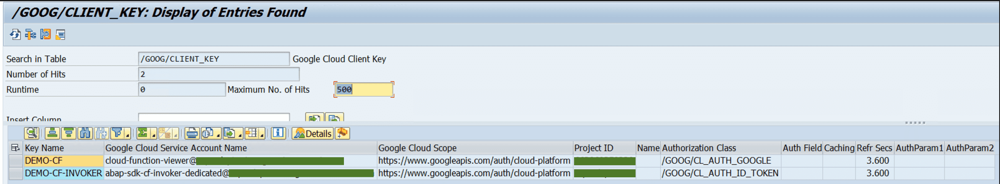

Invoke Cloud Function using Cloud function Invoker: Quickstart
-------------------------------------------------

This quickstart demonstrates how to trigger a cloud function endpoint.

Before you begin
----------------

Before you run this quickstart, make sure that you or your administrators have completed the following prerequisites:

-   You have a Google Cloud account and project.
-   Billing is enabled for your project. [See how to confirm that billing is enabled for your project](https://cloud.google.com/billing/docs/how-to/verify-billing-enabled).
-   The on-premises or any cloud edition of ABAP SDK for Google Cloud is installed and configured. [See how to install and configure the on-premises or any cloud edition of ABAP SDK for Google Cloud](https://cloud.google.com/solutions/sap/docs/abap-sdk/on-premises-or-any-cloud/latest/install-config).
-   Authentication to access Google Cloud APIs is set up. [See how to set up authentication](https://cloud.google.com/solutions/sap/docs/abap-sdk/on-premises-or-any-cloud/latest/authentication).
-   Make sure the Cloud Functions API is enabled in your Google Cloud project.\
    [Go to API library](https://console.cloud.google.com/project/_/apis/library/pubsub.googleapis.com)

Pre-requisites
--------------

1.  Create a Gen-2 cloud function `cf-gen2-hello-with-args` in GCP console with below code: The entry point in this case is `helloWorld`. Its primary purpose is to create a personalized greeting message for a user, pulling their name from either the body or the query parameters of an HTTP request.
```
exports.helloWorld  =  (req,  res)  =>  {
  let  name  =  req.body.name  ||  req.query.name;
  let  full_name  =  `${req.body.firstname}  ${req.body.lastname}`;
  res.status(200).send(`Hello  ${name}!  Full  Name:  ${full_name}`);
};
```

1.  Create a service account `cloud-function-viewer` with roles `Service Account Token Creator` and `Cloud Function Viewer`
2.  Create a client key `DEMO-CF` to access the cloud function endpoint. The authentication setup will be based on where SAP is hosted. Assign the created service account to this client key. This client key is required to instantiate the Cloud Function API Client Stub and will be used to retrieve the cloud function HTTP endpoint.
3.  Create a new service account `cloud-function-invoker` with role `Cloud Run Invoker`
4.  Create a new client key `DEMO-CF-INVOKER` with the newly created service account. The Authentication class will vary depending on the choice of authentication. Please use the [public documentation](https://cloud.google.com/solutions/sap/docs/abap-sdk/on-premises-or-any-cloud/latest/authentication) to identify the authentication best suitaed for your environment.


## Create a program to invoke a Cloud Function
1. In the SAP system, create an executable program in your custom namespace (for example, Z or Y) by using transaction **SE38**.
    1. In the SAP GUI, enter transaction code **SE38**.
    2. In the Program field, enter a name of your program, for example, **ZDEMO_CFINVOKER**.
    3. Click **Create**.
    4. Specify the program attributes:
       1. In the **Title** field, enter a title of your program, for example, **Invoke Cloud Function**.
       2. In the **Type** field, choose **Executable Program**.
    7. Click Save.
    8. Save the program as a Local Object.
    9. In the ABAP Editor, add the [linked code](zr_qs_cfinvoker.prog.abap).

2. Run your application in SE38. If successful below output is displayed:
```
HTTP Return Code:        200
Response: Hello Johnny! Full Name: John Doe
```
