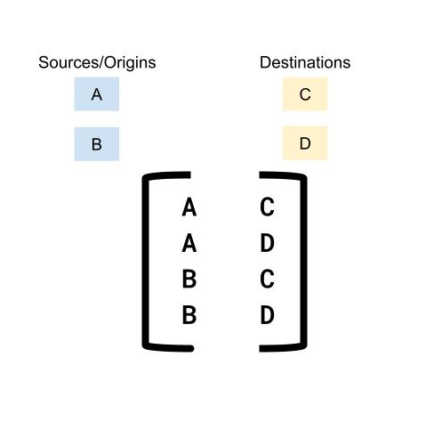

Google Maps Platform - Distance Matrix API : Quickstart
-------------------------------------------------------

Google Maps Platform features now available to ABAP developers!

Google Maps Platform is a suite of APIs and services that allows developers to add maps and location functionality to their applications. This is a great opportunity for ABAP developers to create innovative applications right from the platform they are familiar with. This means that ABAP developers can now create applications that include maps, directions, and other location functionality.

With the ABAP SDK for Google Cloud, ABAP developers can now create applications that take advantage of the power and flexibility of Google Maps Platform services. The ABAP SDK for Google Cloud now includes APIs for a variety of Google Maps Platform features, including:

-   [Address validation](https://developers.google.com/maps/documentation/address-validation): Validate addresses to ensure that they are accurate and complete. This can be useful for applications that need to collect user addresses, such as e-commerce applications and shipping applications.

-   [Directions](https://developers.google.com/maps/documentation/directions/?_gl=1*73lpov*_ga*MTE2MDU2MzI2Ni4xNjk1MzUzOTEw*_ga_NRWSTWS78N*MTY5NTYzOTMwMy4xLjEuMTY5NTYzOTM3OC4wLjAuMA..): Get directions between two locations, including driving, biking, and walking directions. This can be useful for applications that need to provide users with directions, such as navigation applications and travel applications.

-   [Distance Matrix:](https://developers.google.com/maps/documentation/distance-matrix/?_gl=1*1m9rq83*_ga*MTE2MDU2MzI2Ni4xNjk1MzUzOTEw*_ga_NRWSTWS78N*MTY5NTYzOTMwMy4xLjEuMTY5NTYzOTQyOC4wLjAuMA..) Calculate the distance between multiple locations. This can be useful for applications that need to calculate shipping costs or delivery times.

-   [Elevation](https://developers.google.com/maps/documentation/elevation/overview?_gl=1*1fgq2bb*_ga*MTE2MDU2MzI2Ni4xNjk1MzUzOTEw*_ga_NRWSTWS78N*MTY5NTYzOTMwMy4xLjEuMTY5NTYzOTQ0Ny4wLjAuMA..): Get the elevation of a location. This can be useful for applications that need to calculate the slope of a terrain or to determine the visibility from a given location.

-   [Geocoding](https://developers.google.com/maps/documentation/geocoding/?_gl=1*wa1xpo*_ga*MTE2MDU2MzI2Ni4xNjk1MzUzOTEw*_ga_NRWSTWS78N*MTY5NTYzOTMwMy4xLjEuMTY5NTYzOTQ3Ny4wLjAuMA..): Convert addresses into geographic coordinates (latitude and longitude), and vice versa. This can be useful for applications that need to place markers on a map or find nearby places.

-   [Places](https://developers.google.com/maps/documentation/places/web-service): Search for and discover places, such as restaurants, shops, and attractions. This can be useful for applications that need to provide users with information about local businesses and attractions.

-   [Roads](https://developers.google.com/maps/documentation/roads/?_gl=1*6j9i4c*_ga*MTE2MDU2MzI2Ni4xNjk1MzUzOTEw*_ga_NRWSTWS78N*MTY5NTYzOTMwMy4xLjEuMTY5NTYzOTQ0Ni4wLjAuMA..): Get information about roads, such as traffic conditions and speed limits. This can be useful for applications that need to provide users with traffic updates or to calculate travel times.

-   [Time Zones](https://developers.google.com/maps/documentation/timezone/overview?_gl=1*i820xp*_ga*MTE2MDU2MzI2Ni4xNjk1MzUzOTEw*_ga_NRWSTWS78N*MTY5NTYzOTMwMy4xLjEuMTY5NTYzOTUwOC4wLjAuMA..): Get the time zone of a location. This can be useful for applications that need to display the correct time for users in different locations.

The Distance Matrix API is one of the most popular and useful Google Maps Platform APIs. Let's explore it in more detail.

Distance Matrix API
-------------------
The Distance Matrix API is a service that accepts an HTTPS request containing origins and destinations for a given mode of transport. For each combination of origin and destination, it returns travel distance and duration.

You can use the Distance Matrix API to help determine the most efficient travel routes between multiple possible origins and destinations. For example, which workers to send to job sites, or from which warehouses to send packages.

What can the API do?
--------------------

With the Distance Matrix API, you can provide travel distance and time for a matrix of origins and destinations. You can specify several options, including mode of transportation, such as driving, biking, transit or walking, as well as transit modes, such as bus, subway, train, tram, or rail.

The Distance Matrix API provides information based on the recommended route between start and end points. You can request these kinds of distance data:

-   Distance for a selected travel mode

-   Distance in kilometers or miles

-   Estimated travel time in traffic

How does the API Work?
----------------------

The Distance Matrix API uses any number of origins (starting points) and destinations, and returns the distance and travel time between each origin and all requested destinations, starting with the first origin in the request and proceeding step-wise to the next.

For example, if your request specifies A and B as origins, and C and D as destinations, it returns distances and travel time in this order:


Like a matrix, therefore the name Distance Matrix

Applications to support SAP Business Process
--------------------------------------------

### Logistics and Transportation:

The Distance Matrix API can be used to calculate accurate distances and travel times between multiple origins and destinations. This information can be used to optimize route planning, improve delivery times, and reduce transportation costs. For example, in logistics this API could be used to determine the most efficient route for a fleet of delivery vehicles

### Customer Service:

The Distance Matrix API can be used to provide customers with accurate estimates of travel time or delivery times. This information can be used to improve customer satisfaction and reduce the number of customer inquiries. For example, a company could use the API to provide customers with an estimated delivery time of an order.

### Field Service:

The Distance Matrix API can be used to optimize the scheduling of field service technicians. By knowing the distances and travel times between customer locations, companies can ensure that technicians are assigned to the most efficient routes. For example, a company could use the API to determine which technician is closest to a customer location

Analogous to Google Maps App
--------------------------------------------
Almost everyone who uses a smartphone has used Google Maps to look up distance and travel time information at some point, whether it's on their computer or on their phone. \
Below screenshot is a quick snapshot of distance between two offices of two well-known companies:\


You will see how this can be similarly achieved in Scenario 4 within the provided quickstart

Let's take a look at how to use the Distance Matrix API provided by the ABAP SDK for Google Cloud.

Let's get coding!
-----------------

### Before you begin

Before you run this quickstart, make sure that you or your administrators have completed the following prerequisites:

-   You have a Google Cloud account and project. Please keep the Project Id with you which is available in Google Cloud [Dashboard](https://console.cloud.google.com/home/dashboard).

-   Billing is enabled for your project. [See how to confirm that billing is enabled for your project](https://cloud.google.com/billing/docs/how-to/verify-billing-enabled).

-   Configure a client key for authentication.To set up this client key, please follow the instructions in the Service Manager quick start guide under [Client Key Setup.](qs_apikey_stored_in_secret_manager.md)

In your Google Cloud Console, Navigate to Google Maps Platform and enable to Distance Matrix API


We can now use the Distance Matrix API with the API key that is stored in Secret Manager. 

### Code Samples:

Here are some examples of how to use the Distance Matrix API provided by the ABAP SDK for Google Cloud:

---
1.  #### Distance and Travel Time Between Two Places:

Distance Matrix API can give Distance and Travel Time information between one origin and one destination\
Refer to the [Scenario1 ](zr_qs_distance_matrix.prog.abap) for details. 

---
2.  #### Distance and Travel Time Between Multiple Origins and Destination

Distance Matrix API can give Distance and Travel Time information between multiple origins and multiple destinations\
Refer to method [Scenario 2](zr_qs_distance_matrix.prog.abap) for details. 

---
3.  #### Distance and Travel Time Between Two Places with preferred travel modes and stipulated departure time

Distance Matrix API can give Distance and Travel Time information based on travel and transit mode along with a provided departure time.\
Please note: departure time cannot be in the past.
In this example we show the travel mode ```driving``` is used along with transit mode ```bus```\
Refer to the [Scenario 3 ](zr_qs_distance_matrix.prog.abap) for details. 


---
4.  #### Travel Time Between Places using different mode of transport

Distance Matrix API can give Distance and Travel Time information based on different travel modes, in this example we use travel mode as ```walking```
Refer to the [Scenario 4](zr_qs_distance_matrix.prog.abap) for details. 

### Conclusion

The Distance Matrix API is an useful API that can be used to add geospataial intelligence into your SAP applications. If you are working with location data in SAP, we encourage you to learn more about the Distance Matrix offered as part of the ABAP SDK for Google Cloud.