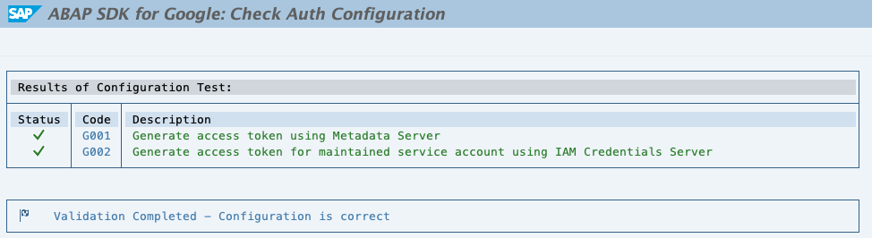

Data Loss Prevention Deidentification: Quickstart
-------------------------------------------------

### What is Data Loss Prevention API

The [Data Loss Prevention (DLP) API ](https://cloud.google.com/dlp/)provided by Google Cloud Platform offers the following three operations for protecting sensitive data:

-   Redaction: Redaction is the process of obscuring or removing sensitive data from text, images, or other types of content. When you redact sensitive data, you are making it difficult or impossible for someone to identify the individuals in the data. The DLP API supports several redaction techniques, including masking, tokenization, and encryption.

-   Deidentification: Deidentification is the process of modifying sensitive data so that it is no longer personally identifiable. This can be done by replacing names, dates, or other identifying information with pseudonyms or generalizations. Deidentification makes it difficult to link the data to specific individuals, but it does not guarantee that the data is anonymous. The DLP API supports several deidentification techniques, including pseudonymization, generalization, and suppression.

-   Anonymization: Anonymization is the process of transforming sensitive data so that it is no longer possible to identify the individuals in the data. This can be done by using techniques such as k-anonymity, differential privacy, or homomorphic encryption. Anonymization is the strongest form of privacy protection, but it can also be the most difficult to achieve. The DLP API does not directly support anonymization, but you can use it to implement your own anonymization logic.

In the context of the DLP API, the following table summarizes the key differences between redaction, deidentification, and anonymization:

| Operation    | Description         | Level of protection | Examples         |
| ------------ | ------------------- | ------------- |------------- |
| Redaction    | Obscuration or removal of sensitive data | Low | Masking, tokenization, encryption |
| Deidentification    | Modification of sensitive data so that it is no longer personally identifiable | Medium | Pseudonymization, generalization, suppression |
| Anonymization    | Transformation of sensitive data so that it is no longer possible to identify the individuals in the data | High | K-anonymity, differential privacy, homomorphic encryption |

The choice of which operation to use depends on the specific business requirements. If you need to protect sensitive data from unauthorized access, redaction may be sufficient. However, if you need to comply with privacy regulations, such as GDPR or HIPAA, you may need to deidentify or anonymize the data.

The DLP API provides a variety of features to help you choose the right operation for your needs. You can use the DLP API to:
-   Identify sensitive data: The DLP API can help you identify sensitive data in your datasets. The API includes a library of built-in detectors for common types of sensitive data, such as credit card numbers, Social Security numbers, and personally identifiable information (PII). You can also create your own custom detectors for specific types of sensitive data.

-   Classify sensitive data: Once you have identified sensitive data, you can classify it according to its sensitivity level. This will help you determine the appropriate privacy protection measures to apply.

-   Protect sensitive data: The DLP API provides a variety of techniques for protecting sensitive data, including redaction, deidentification, and anonymization. You can choose the right technique for your needs based on the sensitivity level of the data and the privacy requirements of your application.

-   Monitor and audit sensitive data: The DLP API can help you monitor and audit sensitive data. This will help you ensure that the data is being protected correctly.

The DLP API is a powerful tool for protecting sensitive data. By using the DLP API, you can comply with privacy regulations, protect your customers' privacy, and reduce the risk of data breaches. Please refer to the [code sample](https://cloud.google.com/dlp/docs/samples) for some quick references.\
Below is a quick start of consuming DLP API using ABAP SDK for Google Cloud to execute an Email ID **Deidentification scenario**.

### Before you begin

Before you run this quickstart, make sure that you or your administrators have completed the following prerequisites:

-   You have a Google Cloud account and project. Please keep the Project Id with you which is available in Google Cloud [Dashboard](https://console.cloud.google.com/home/dashboard).

-   Billing is enabled for your project. [See how to confirm that billing is enabled for your project](https://cloud.google.com/billing/docs/how-to/verify-billing-enabled).

#### Enable required services

-   Click Activate Cloud Shell at the top of the [Google Cloud console](https://console.cloud.google.com/home/dashboard) to Open Cloud Shell. We will use the Cloud Shell to run all our commands.

-   Enable Google Service to be accessed by ABAP SDK (Replace the string `PROJECT_ID` with your Google Cloud project Id)
```
gcloud auth login
gcloud config set project PROJECT_ID
gcloud services enable iamcredentials.googleapis.com
gcloud services enable dlp.googleapis.com
```

### Configure client key for DLP Access

The below configuration will be used by the ABAP SDK to connect to the secret manager API.

Goto SPRO > ABAP SDK for Google Cloud > Basic Settings > Configure Client Key and add the following new entry. (Replace the string `PROJECT_ID` with your Google Cloud project Id)

| Field Name                             | Value         |
| ------------------------------------   | ------------- |
| **Google Cloud Key Name:**             | DEMO_DLP |
| **Google Cloud Service Account Name:** | abap-sdk-qs@PROJECT_ID.iam.gserviceaccount.com |
| **Google Cloud Scope:**                | https://www.googleapis.com/auth/cloud-platform |
| **Google Cloud Project Identifier:**   | PROJECT_ID |
| **Authorization Class:**               | /GOOG/CL_AUTH_GOOGLE |

**NOTE** Leave the other fields blank

*  Validate the configuration 'CLIENT_KEY_SM' using SPRO > ABAP SDK for Google Cloud > Utilities > Validate Authentication Configuration.


### Create a program for an example Deidentification scenario.

-   Create a program in SE38 and paste the [linked](zr_qs_dlp_deidentify.prog.abap) code, which deidentifies the email id from the text and replaces it with a generic string. 

-   Note: The Client key used in the below program is `DEMO_DLP` which will be used by the SDK to connect to the API.

### Sales Order Header Text Example

Lets see DLP in action! Below is an example where the DLP API was used to deidentify personally identifiable information (PII) from Sales Order Header Text, in case the user enters the same.
[](videos/vid-dlp-email-deidentification.mp4)


### Clean Up

For clean up disable the service to avoid any usage.

```
gcloud services disable dlp.googleapis.com --force
```