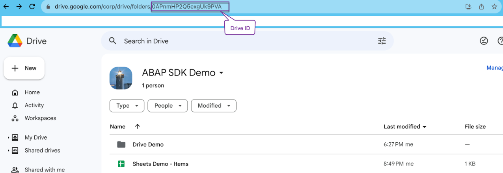

Google Drive API : Quickstart
-----------------------------

Google Workspace APIs are now available to ABAP Developers with the release of Version 1.5 of ABAP SDK for Google Cloud.

Google Workspace APIs are a set of web services that allow developers to integrate their applications with Google Workspace. This includes popular productivity apps like Gmail, Calendar, Drive, Docs, Sheets, and Slides. With Google Workspace APIs, developers can create new applications or extend existing ones to automate tasks, create custom integrations, and build new user experiences.

With the ABAP SDK for Google Cloud, SAP developers can consume these APIs directly from their ABAP layer and enrich their SAP applications with the power of Google Workspace. The [Google Drive API](https://developers.google.com/drive) is a RESTful API that lets access resources from Google Drive and is enabled in the 1.5 version of the SDK.

This quickstart guide shows how to list the files and folders in a shared Google Drive. You can also pass query parameters to filter the result set.

### Before you begin

Before you run this quickstart, make sure that you or your administrators have completed the following prerequisites:

-   You have a Google Cloud account and project. Please keep the Project Id with you which is available in Google Cloud [Dashboard](https://console.cloud.google.com/home/dashboard).

-   Billing is enabled for your project. [See how to confirm that billing is enabled for your project](https://cloud.google.com/billing/docs/how-to/verify-billing-enabled).

-   Google Drive API is enabled for your GCP project.

-   Your SAP system supports OAuth 2.0 and you have imported the OAuth extension TR along with the SDK product TR as per [installation guidelines](https://cloud.google.com/solutions/sap/docs/abap-sdk/latest/install-config#install_the).

-   You have followed the [authentication setup guidelines](https://cloud.google.com/solutions/sap/docs/abap-sdk/latest/authentication#oauth_with_client_credentials) on Google Cloud console for your GCP project to,

    -   [Create OAuth 2.0 Consent](https://cloud.google.com/solutions/sap/docs/abap-sdk/latest/authentication#oauth_config_consent),

    -   [Create OAuth 2.0 Client ID credentials](https://cloud.google.com/solutions/sap/docs/abap-sdk/latest/authentication#oauth_create_credentials),

    -   [Create OAuth 2.0 Client Profile](https://cloud.google.com/solutions/sap/docs/abap-sdk/latest/authentication#oauth_setup_client_profile),

    -   [Configure OAuth 2.0 Client](https://cloud.google.com/solutions/sap/docs/abap-sdk/latest/authentication#oauth_configure_client),

    -   [Request OAuth 2.0 request token](https://cloud.google.com/solutions/sap/docs/abap-sdk/latest/authentication#oauth_request_token).

-   You have authorization to access the Drive scope for your ID.

### Configure client key and OAuth profile

Create a client key with the OAuth 2.0 authentication class "/GOOG/CL_OAUTH_GOOGLE" and configured OAuth 2.0 profile for Drive API as per guidelines [here](https://cloud.google.com/solutions/sap/docs/abap-sdk/latest/authentication#oauth_configure_client_key).

Below is a client key which we would be using in the quick start.

Below is the OAuth profile with Drive scopes.

#### Program to list contents of a Drive

-   Let's take an example of a Drive with a folder and a file, "Drive ID" is the unique identifier for the Drive and can be referenced from the URL.

-   "/GOOG/CL_DRIVE_V3" is the API class enabled in the 1.5 version of the SDK for Google Drive, "LIST_FILES" is the method to list the contents of a Drive.

-   Below parameters should be passed to the method for a shared drive,

    -   ID of the Drive, you can get that from the Drive's URL.

    -   CORPORA which is to identify the item to be accessed, we pass "drive" for accessing drive contents.

    -   Flag to include items from all drives, set as "true".

    -   Flag to support all drives, set as "true".

-   The method returns the sheet data as an output of ABAP type "TY_011" ([FileList](https://developers.google.com/drive/api/reference/rest/v3/files/list#response-body)).

-   Field "FILES" in the output holds the items in the drive.

Here is a [code sample](zr_qs_drive_list_files.prog.abap) to list contents of a Drive and display the name, id, kind and mime type of the items.

-   Below is the output of the code sample showing the read contents.
