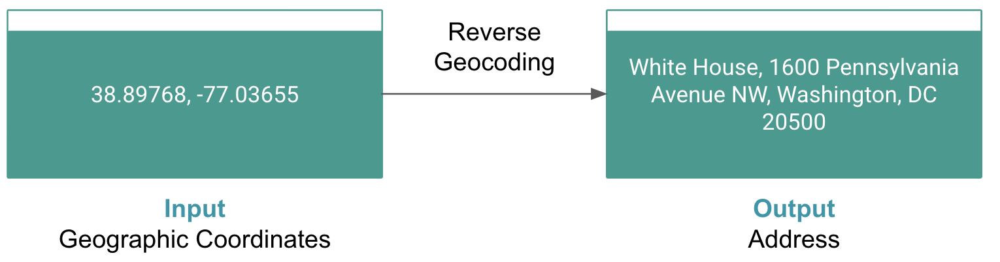

Google Maps - Geocoding : Quickstart
------------------------------------

Google Maps Platform features now available to ABAP developers!

Google Maps Platform is a suite of APIs and services that allows developers to add maps and location functionality to their applications. This is a great opportunity for ABAP developers to create innovative applications right from the platform they are familiar with. This means that ABAP developers can now create applications that include maps, directions, and other location functionality.

With the ABAP SDK for Google Cloud, ABAP developers can now create applications that take advantage of the power and flexibility of Google Maps Platform services. The ABAP SDK for Google Cloud now includes APIs for a variety of Google Maps Platform features, including:

-   [Address validation](https://developers.google.com/maps/documentation/address-validation): Validate addresses to ensure that they are accurate and complete. This can be useful for applications that need to collect user addresses, such as e-commerce applications and shipping applications.

-   [Directions](https://developers.google.com/maps/documentation/directions/?_gl=1*73lpov*_ga*MTE2MDU2MzI2Ni4xNjk1MzUzOTEw*_ga_NRWSTWS78N*MTY5NTYzOTMwMy4xLjEuMTY5NTYzOTM3OC4wLjAuMA..): Get directions between two locations, including driving, biking, and walking directions. This can be useful for applications that need to provide users with directions, such as navigation applications and travel applications.

-   [Distance Matrix:](https://developers.google.com/maps/documentation/distance-matrix/?_gl=1*1m9rq83*_ga*MTE2MDU2MzI2Ni4xNjk1MzUzOTEw*_ga_NRWSTWS78N*MTY5NTYzOTMwMy4xLjEuMTY5NTYzOTQyOC4wLjAuMA..) Calculate the distance between multiple locations. This can be useful for applications that need to calculate shipping costs or delivery times.

-   [Elevation](https://developers.google.com/maps/documentation/elevation/overview?_gl=1*1fgq2bb*_ga*MTE2MDU2MzI2Ni4xNjk1MzUzOTEw*_ga_NRWSTWS78N*MTY5NTYzOTMwMy4xLjEuMTY5NTYzOTQ0Ny4wLjAuMA..): Get the elevation of a location. This can be useful for applications that need to calculate the slope of a terrain or to determine the visibility from a given location.

-   [Geocoding](https://developers.google.com/maps/documentation/geocoding/?_gl=1*wa1xpo*_ga*MTE2MDU2MzI2Ni4xNjk1MzUzOTEw*_ga_NRWSTWS78N*MTY5NTYzOTMwMy4xLjEuMTY5NTYzOTQ3Ny4wLjAuMA..): Convert addresses into geographic coordinates (latitude and longitude), and vice versa. This can be useful for applications that need to place markers on a map or find nearby places.

-   [Places](https://developers.google.com/maps/documentation/places/web-service): Search for and discover places, such as restaurants, shops, and attractions. This can be useful for applications that need to provide users with information about local businesses and attractions.

-   [Roads](https://developers.google.com/maps/documentation/roads/?_gl=1*6j9i4c*_ga*MTE2MDU2MzI2Ni4xNjk1MzUzOTEw*_ga_NRWSTWS78N*MTY5NTYzOTMwMy4xLjEuMTY5NTYzOTQ0Ni4wLjAuMA..): Get information about roads, such as traffic conditions and speed limits. This can be useful for applications that need to provide users with traffic updates or to calculate travel times.

-   [Time Zones](https://developers.google.com/maps/documentation/timezone/overview?_gl=1*i820xp*_ga*MTE2MDU2MzI2Ni4xNjk1MzUzOTEw*_ga_NRWSTWS78N*MTY5NTYzOTMwMy4xLjEuMTY5NTYzOTUwOC4wLjAuMA..): Get the time zone of a location. This can be useful for applications that need to display the correct time for users in different locations.

The Geocoding API is one of the most popular and useful Google Maps Platform APIs. Let's explore it in more detail.

Geocode API:
------------

The Geocoding API is a service that allows you to convert addresses into geographic coordinates (latitude and longitude) and vice versa.

The Geocoding API offers a variety of features that can be used to convert addresses to geographic coordinates and vice versa. These features can be used to power a variety of applications, such as mapping applications, navigation systems, and local search engines.

-   **Forward geocoding** is the process of converting an address into geographic coordinates. This can be useful for locating a specific place on a map or for determining the distance between two places.

-   **Reverse geocoding** is the process of converting geographic coordinates into an address. This can be useful for identifying the address of a place that you are at or for determining the address of a place that you are interested in.

-   **Place ID geocoding** is the process of converting a Place ID into an address or geographic coordinates. A Place ID is a unique identifier that is assigned to a place by Google Maps. Place IDs can be used to reference specific places on a map, such as businesses, landmarks, and addresses.

-   **Viewport biasing** allows you to constrain the results of a geocoding request to a specific viewport. This can be useful for narrowing down the results to a specific area.

-   **Region biasing** allows you to constrain the results of a geocoding request to a specific region. This can be useful for narrowing down the results to a specific country or state.

-   **Component filtering** allows you to restrict the results of a geocoding request to a specific country, postal code, or locality. This can be useful for narrowing down the results to a specific geographic area.

Applications in SAP
-------------------

You can use these coordinates that are determined by Geocoding API in various SAP applications; for example:

1.  Use the Geocoding API to optimize shipping routes in SAP Transportation Management.

SAP Transportation Management is a transportation management system that can be used to optimize shipping routes and calculate delivery times. You can use the Geocoding API to geocode the pickup and delivery addresses in SAP Transportation Management. This information can then be used to optimize the shipping routes and calculate the delivery times.

2.  Use the Geocoding API to track the location of customers and sales representatives in SAP CRM.

SAP CRM is a customer relationship management system that can be used to track the location of customers and sales representatives. You can use the Geocoding API to geocode the addresses of your customers and sales representatives. This information can then be used to track their location on a map and to identify potential customers in a given area.

It can also be used for below use cases: 

-   Display of business objects on a map, for example a location (either standalone or as start/destination of a transportation lane, schedule, or TM(Transport Management) business document like a freight unit or freight order)

-   Determination of the distance 

-   Routing (for example, in Transportation Planning, determining a route on a street basis)

-   Regional evaluation (for example, evaluating all customers within a radius of 50km or determining the nearest competitor)

ABAP SDK provides an implicit way to connect to Google Maps Geocode API and retrieve geocoordinates. 

Let's take a look at how to use the Geocoding API provided by the ABAP SDK for Google Cloud.

Let's get coding!
-----------------

### Before you begin

Before you run this quickstart, make sure that you or your administrators have completed the following prerequisites:

-   You have a Google Cloud account and project. Please keep the Project Id with you which is available in Google Cloud [Dashboard](https://console.cloud.google.com/home/dashboard).

-   Billing is enabled for your project. [See how to confirm that billing is enabled for your project](https://cloud.google.com/billing/docs/how-to/verify-billing-enabled).

-   Configure a client key for authentication.To set up this client key, please follow the instructions in the Service Manager quick start guide under [Client Key Setup.](qs_apikey_stored_in_secret_manager.md)

We can now use the Geocoding API with the API key that is stored in Secret Manager. 

### Code Samples:

Here are some examples of how to use the Geocoding API provided by the ABAP SDK for Google Cloud:

---
1.  #### Forward Geocoding:

Forward geocoding is a process of converting addresses or place names into geographic coordinates, such as latitude and longitude.


Refer to method [forward_geocoding](zr_qs_geocode.prog.abap) for details. 

---
2.  #### Reverse Geocoding

Reverse geocoding is the process of converting geographic coordinates, such as latitude and longitude, into a human-readable address or place name. It is the opposite of forward geocoding, which converts addresses or place names into geographic coordinates.



Refer to method [reverse_geocoding](zr_qs_geocode.prog.abap) for details. 

---
3.  #### Place ID Geocoding

Place ID geocoding is a specific type of forward geocoding that uses a place ID to convert an address or place name into geographic coordinates. Place IDs are unique identifiers that are assigned to places by Google Maps.

Place ID geocoding is more reliable and accurate than traditional forward geocoding methods, because it uses a database of known place locations. This is especially important for places with ambiguous or difficult-to-spell addresses.


Refer to method [place_id_geocoding](zr_qs_geocode.prog.abap) for details. 

---
4.  #### Viewport Biasing

Viewport biasing is a feature of the Google Maps Platform Geocoding API that allows you to bias the geocoding results to a specific geographic area. This can be useful if you are only interested in results within a certain region, or if you want to prioritize results that are closer to the user's current location.

To use viewport biasing, you simply need to specify the bounds of the viewport in your geocoding request. You can do this using the bounds parameter. The bounds parameter is a bounding box, which is defined by two latitude/longitude coordinates: the southwest corner and the northeast corner.

For example, to bias the geocoding results to the San Francisco Bay Area, you would use the following bounds parameter:

```
bounds=37.7833,-122.4167|37.8044,-122.3911
```

This bounding box covers the entire San Francisco Bay Area, from San Francisco to Oakland to San Jose.

When you bias the geocoding results to a specific viewport, the Geocoding API will still return all of the results that are within the viewport, even if they are not the most relevant results. However, the API will prioritize the results that are closest to the center of the viewport.

Refer to method [viewport_biasing](zr_qs_geocode.prog.abap) for details. 

---
5.  #### Region Biasing

Region biasing is a feature of the Google Maps Platform Geocoding API that allows you to bias the geocoding results to a specific geographic region. This can be useful if you are only interested in results within a certain country or continent, or if you want to prioritize results that are more likely to be relevant to your users.

To use region biasing, you simply need to specify the region code in your geocoding request. You can do this using the region parameter. The region parameter is a two-character code that represents a country or continent. For example, to bias the geocoding results to the United States, you would use the following region parameter:

```
region=US
```

When you bias the geocoding results to a specific region, the Geocoding API will still return all of the results that are within the region, even if they are not the most relevant results. However, the API will prioritize the results that are most likely to be relevant to your users.

Refer to method [region_biasing](zr_qs_geocode.prog.abap) for details. 

---
6.  #### Component Filtering

Component filtering is a feature of the Google Maps Platform Geocoding API that allows you to restrict the geocoding results to a specific set of address components. Address components are the individual parts of an address, such as the street name, house number, city, state, and country.

To use component filtering, you simply need to specify the address components that you want to filter by in your geocoding request. You can do this using the components parameter. The components parameter is a list of component:value pairs. For example, to filter the results to addresses in the city of San Francisco, California, you would use the following components parameter:

```
components=locality:San  Francisco|administrative_area:CA
```

You can also use component filtering to filter the results to addresses in a specific postal code, country, or route.

Refer to method [component_filtering](zr_qs_geocode.prog.abap) for details. 

---
### Conclusion

The Geocoding API is a powerful tool that can be used to add location intelligence to your SAP applications. If you are working with location data in SAP, I encourage you to learn more about the Geocoding API offered as part of the ABAP SDK for Google Cloud.