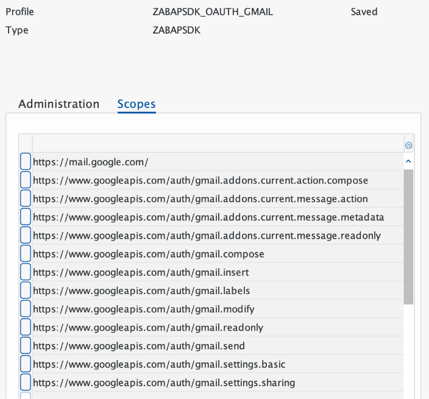

Gmail API : Quickstart
----------------------

Google Workspace APIs are now available to ABAP Developers with the release of Version 1.5 of ABAP SDK for Google Cloud.

Google Workspace APIs are a set of web services that allow developers to integrate their applications with Google Workspace. This includes popular productivity apps like Gmail, Calendar, Drive, Docs, Sheets, and Slides. With Google Workspace APIs, developers can create new applications or extend existing ones to automate tasks, create custom integrations, and build new user experiences.

With the ABAP SDK for Google Cloud, SAP developers can consume these APIs directly from their ABAP layer and enrich their SAP applications with the power of Google Workspace. The [Gmail API](https://developers.google.com/gmail) is a RESTful API that can be used to access Gmail mailboxes and send mail, and is enabled in the 1.5 version of the SDK.

This quickstart guide shows how to,

-   Get a list of emails from a Gmail mailbox based on filters such as "Labels".

-   Get contents of an email.

-   Get attachments from an email.

### Before you begin

Before you run this quickstart, make sure that you or your administrators have completed the following prerequisites:

-   You have a Google Cloud account and project. Please keep the Project Id with you which is available in Google Cloud [Dashboard](https://console.cloud.google.com/home/dashboard).

-   Billing is enabled for your project. [See how to confirm that billing is enabled for your project](https://cloud.google.com/billing/docs/how-to/verify-billing-enabled).

-   Gmail API is enabled for your GCP project.

-   Your SAP system supports OAuth 2.0 and you have imported the OAuth extension TR along with the SDK product TR as per [installation guidelines](https://cloud.google.com/solutions/sap/docs/abap-sdk/latest/install-config#install_the).

-   You have followed the [authentication setup guidelines](https://cloud.google.com/solutions/sap/docs/abap-sdk/latest/authentication#oauth_with_client_credentials) on Google Cloud console for your GCP project to,

    -   [Create OAuth 2.0 Consent](https://cloud.google.com/solutions/sap/docs/abap-sdk/latest/authentication#oauth_config_consent),

    -   [Create OAuth 2.0 Client ID credentials](https://cloud.google.com/solutions/sap/docs/abap-sdk/latest/authentication#oauth_create_credentials),

    -   [Create OAuth 2.0 Client Profile](https://cloud.google.com/solutions/sap/docs/abap-sdk/latest/authentication#oauth_setup_client_profile),

    -   [Configure OAuth 2.0 Client](https://cloud.google.com/solutions/sap/docs/abap-sdk/latest/authentication#oauth_configure_client),

    -   [Request OAuth 2.0 request token](https://cloud.google.com/solutions/sap/docs/abap-sdk/latest/authentication#oauth_request_token).

-   You have authorization to access the Gmail account with required scopes for your ID.

### Configure client key and OAuth profile

Create a client key with the OAuth 2.0 authentication class "/GOOG/CL_OAUTH_GOOGLE" and configured OAuth 2.0 profile for Gmail API as per guidelines [here](https://cloud.google.com/solutions/sap/docs/abap-sdk/latest/authentication#oauth_configure_client_key).

Below is a client key which we would be using in the quick start.

Below is the OAuth profile with Gmail scopes.

Here is an example email with a Purchase Order request from a vendor having a PDF attachment with Purchase Order details with a label "PODEMO" associated with it.

In this quickstart we would,

-   List all the Purchase Order requests from the mailbox with label "PODEMO" associated,

-   Get email content for each request,

-   Get attached Purchase Order documents.

#### List messages using label as a filter

-   Method "LIST_MESSAGES" of class "/GOOG/CL_GMAIL_V1" can be used to get a list of emails from a Gmail account with some query parameters.

-   Email ID is a mandatory parameter to be passed as input under "IV_P_USER_ID", you can hardcode "me" as string input to by default pass your email id.

-   Label ID can be passed in query parameter "IV_Q_LABELIDS".

-   Each email [message](https://developers.google.com/gmail/api/reference/rest/v1/users.messages#Message) in Gmail is associated with a message id and a thread id to uniquely identify the message.

-   The method returns the messages in ABAP Type "TY_033" ([ListMessagesResponse](https://developers.google.com/gmail/api/reference/rest/v1/users.messages/list#response-body)).

-   Here is a [code sample](zr_qs_gmail_list_messages.prog.abap) to list all the emails with a "Label".

-   Below is the output of the code sample showing the returned message id of the message with label passed as "PODEMO".

#### Get content of an email

-   Method "GET_MESSAGES" of class "/GOOG/CL_GMAIL_V1" can be used to get the content of an email message as a [multipart output](https://developers.google.com/gmail/api/reference/rest/v1/users.messages#Message.MessagePart) embedded in a [message](https://developers.google.com/gmail/api/reference/rest/v1/users.messages#Message).

-   Email ID is a mandatory parameter to be passed as input under "IV_P_USER_ID", you can hardcode "me" as string input to by default pass your email id.

-   Message ID is a mandatory parameter to be passed under "IV_P_ID".

-   During runtime Message IDs for the emails can be determined by calling the "LIST_MESSAGES" method of the class.

-   The method returns the content in ABAP Type "TY_037" ([Message](https://developers.google.com/gmail/api/reference/rest/v1/users.messages#Message)) which has embedded type "TY_038" ([MessagePart](https://developers.google.com/gmail/api/reference/rest/v1/users.messages#Message.MessagePart)) to hold the message parts.

-   Each email [message](https://developers.google.com/gmail/api/reference/rest/v1/users.messages#Message) in Gmail is associated with a message id and a thread id to uniquely identify the message.

-   Developers would have to do some post processing logic to extract the content out of the response data, here is a [code sample](zr_qs_gmail_get_messages.prog.abap) to get contents of an email message.

-   In order to get the content of all the PO requests, call this code sample in a loop iteration for "LS_OUTPUT-MESSAGES[]" received from calling "LIST_MESSAGES" in [code sample](zr_qs_gmail_list_messages.prog.abap) here, "ID" of iterated LS_OUTPUT-MESSAGES[] can be passed in "IV_P_ID" of "GET_MESSAGES".

-   Below is the output of the code sample showing the,

    -   Extracted email body text,

    -   and, the attachment id.

#### Get attachments

-   Method "GET_MESSAGES" can be called to get the content of an email.

-   Each attachment in a Gmail message is associated with an "Attachment ID" to uniquely identify the attachment, and the same can be determined from the output of "GET_MESSAGES".

-   Method "GET_ATTACHMENTS" of class "/GOOG/CL_GMAIL_V1" can be used to read the attachment data for the attachment id in a Base64 encoded string.

-   Email ID is a mandatory parameter to be passed as input under "IV_P_USER_ID", you can hardcode "me" as string input to by default pass your email id.

-   Message ID is a mandatory parameter to be passed under "IV_P_MESSAGE_ID".

-   Attachment ID is a mandatory parameter to be passed under "IV_P_ID".

-   The method returns the attachment content in ABAP Type "TY_039" ([MessagePartBody](https://developers.google.com/gmail/api/reference/rest/v1/users.messages.attachments#MessagePartBody)) as response.

-   Developers would have to do some post processing logic to extract the attachment content out of the response data, here is a [code sample](zr_qs_gmail_get_attachments.prog.abap) to get contents of an email attachment in Base64 encoded string.

-   Below is the output of the code sample showing the extracted attachment data.

-   The returned encoded data can be passed to Google Cloud's Document AI using class "/GOOG/CL_DOCUMENTAI_V1" enabled in the SDK, method "PROCESS_PROCESSORS" can be used to parse the document and extract the entities ([Code sample](https://cloud.google.com/solutions/sap/docs/abap-sdk/samples/docai-process-single-document)).