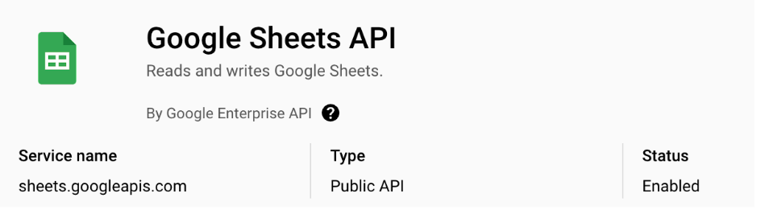
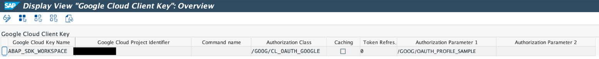
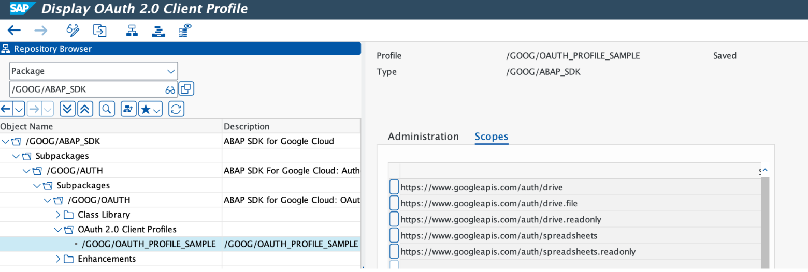
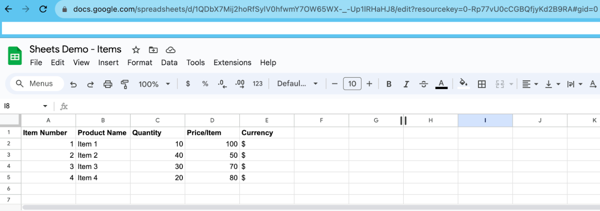
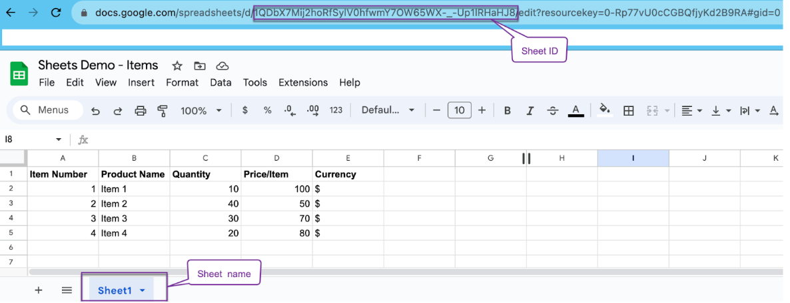
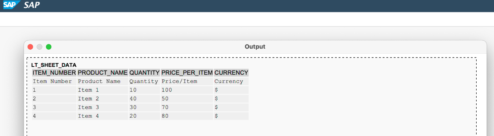

Google Sheets API : Quickstart
------------------------------

Google Workspace APIs are now available to ABAP Developers with the release of Version 1.5 of ABAP SDK for Google Cloud.

Google Workspace APIs are a set of web services that allow developers to integrate their applications with Google Workspace. This includes popular productivity apps like Gmail, Calendar, Drive, Docs, Sheets, and Slides. With Google Workspace APIs, developers can create new applications or extend existing ones to automate tasks, create custom integrations, and build new user experiences.

With the ABAP SDK for Google Cloud, SAP developers can consume these APIs directly from their ABAP layer and enrich their SAP applications with the power of Google Workspace. The [Google Sheets API](https://developers.google.com/sheets) is a RESTful API that lets you read and modify a spreadsheet's data and is enabled in the 1.5 version of the SDK.

This quickstart guide shows how to access the content of a Google sheet using ABAP SDK for Google Cloud V1.5 and above.

### Before you begin

Before you run this quickstart, make sure that you or your administrators have completed the following prerequisites:

-   You have a Google Cloud account and project. Please keep the Project Id with you which is available in Google Cloud [Dashboard](https://console.cloud.google.com/home/dashboard).

-   Billing is enabled for your project. [See how to confirm that billing is enabled for your project](https://cloud.google.com/billing/docs/how-to/verify-billing-enabled).

-   Google Sheets API is enabled for your GCP project.

-   Your SAP system supports OAuth 2.0 and you have imported the OAuth extension TR along with the SDK product TR as per [installation guidelines](https://cloud.google.com/solutions/sap/docs/abap-sdk/latest/install-config#install_the).

-   You have followed the [authentication setup guidelines](https://cloud.google.com/solutions/sap/docs/abap-sdk/latest/authentication#oauth_with_client_credentials) on Google Cloud console for your GCP project to,

    -   [Create OAuth 2.0 Consent](https://cloud.google.com/solutions/sap/docs/abap-sdk/latest/authentication#oauth_config_consent),

    -   [Create OAuth 2.0 Client ID credentials](https://cloud.google.com/solutions/sap/docs/abap-sdk/latest/authentication#oauth_create_credentials),

    -   [Create OAuth 2.0 Client Profile](https://cloud.google.com/solutions/sap/docs/abap-sdk/latest/authentication#oauth_setup_client_profile),

    -   [Configure OAuth 2.0 Client](https://cloud.google.com/solutions/sap/docs/abap-sdk/latest/authentication#oauth_configure_client),

    -   [Request OAuth 2.0 request token](https://cloud.google.com/solutions/sap/docs/abap-sdk/latest/authentication#oauth_request_token).

-   You have authorization to access the Sheet scope for your ID.

### Configure client key and OAuth profile

Create a client key with the OAuth 2.0 authentication class "/GOOG/CL_OAUTH_GOOGLE" and configured OAuth 2.0 profile for Sheets API as per guidelines [here](https://cloud.google.com/solutions/sap/docs/abap-sdk/latest/authentication#oauth_configure_client_key).

Below is a client key which we would be using in the quick start.

Below is the OAuth profile with Sheets scopes (using the one shipped with the latest version of the SDK).

#### Access contents of a sheet

-   Let's take an example of a Sheet with line item details for an order.

-   "/GOOG/CL_SHEETS_V4" is the API class enabled in the 1.5 version of the SDK for Google Sheets, "GET_VALUES" is the method to get the sheet's data.

-   The mandatory parameters for the method are,

    -   ID of the Sheet, you can get that from the Sheet's URL.

    -   Range of the sheet's information, you can get that by using the [A1 notation or R1C1 notation](https://developers.google.com/sheets/api/guides/concepts#cell), for this quickstart, we would be mentioning the Sheet name.
    

-   The method returns the sheet data as an output of ABAP type "TY_240" ([ValueRange](https://developers.google.com/sheets/api/reference/rest/v4/spreadsheets.values#ValueRange)).

-   Field "VALUES" in the output holds the sheet data in a nested string table reference.

-   Developers would have to do a post processing to consume the fetched data by defining ABAP types (local or global) of the sheet columns and mapping the fetched data to the defined types.

-   Here is a [code sample](zr_qs_sheets_get_values.prog.abap) to invoke, fetch and post process the item data in the example sheet.

-   Below is the output of the code sample showing the read sheet data when passed the Sheet ID of the example sheet.
