# Vector Search fueled by Embeddings from SAP
This document describes how to build Generative AI powered ABAP applications that use [Vertex AI Vector Search](https://cloud.google.com/vertex-ai/docs/vector-search/overview) for retrieving RAG content to augment the AI model’s context to keep the model responses grounded to your enterprise data. We would be showcasing how to invoke Vector Search natively from your ABAP applications using [Vertex AI SDK for ABAP](https://cloud.google.com/solutions/sap/docs/abap-sdk/vertex-ai-sdk/latest/overview).

With the help of the reference architecture explained in this document, you can build intelligent SAP business applications powered by enterprise level [“semantic search”](https://cloud.google.com/vertex-ai/docs/vector-search/overview#introduction), which helps business users extract data-driven insights from your most recent enterprise data (SAP and non-SAP) to accelerate business decision-making processes within SAP.

The intended audience for this document includes developers, SAP solution architects, and cloud architects. The document assumes a basic understanding of [terminologies in Vector Search](https://cloud.google.com/vertex-ai/docs/vector-search/overview#terminology).

## Architecture
The following diagram demonstrates a reference architecture on how to invoke Vertex AI vector search from SAP business logic (standalone SAP extension and web applications) using Vertex AI SDK for ABAP, natively from your ABAP environment.

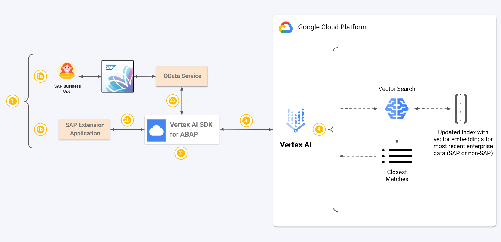

This guide includes the following components:
<table>
    <thead>
        <tr>
            <th>Component</th>
            <th>Subsystem</th>
            <th>Details</th>
        </tr>
    </thead>
    <tbody>
        <tr>
            <td>1</td>
            <td rowspan=3>SAP Application Logic</td>
            <td>Prepare your search query which can be, Natural language based search strings, or a vector embedding, or an SAP enterprise business object id (for example, sales order number, material number, etc.).</td>
        </tr>
        <tr>
            <td>2</td>
            <td>Invoke vector search using the SDK from your SAP extension applications (enhancements, report programs, background jobs, etc.), and ODATA service logic to power your SAP web applications </td>
        </tr>
        <tr>
            <td>3</td>
            <td>Invoke Vector Search Invoker module of the SDK to execute vector search for the search query</td>
        </tr>
        <tr>
            <td>4</td>
            <td>Google Cloud Vertex AI</td>
            <td>Vector search is performed and closest matches are returned with respect to the searched query on the most recent enterprise data indexed in the form of vector embeddings</td>
        </tr>
    </tbody>
</table>

## Products used

This reference architecture uses the following Google Cloud products:
* [Vertex AI SDK for ABAP](https://cloud.google.com/solutions/sap/docs/abap-sdk/vertex-ai-sdk/latest/overview): Provides you with modules and toolsets to build AI-centric applications natively from ABAP.
* [Vertex AI Vector Search](https://cloud.google.com/vertex-ai/docs/vector-search/overview): Google Cloud [Vertex AI](https://cloud.google.com/vertex-ai?hl=en) powered managed service which allows for high-scale and efficient searches across your enterprise data using vector embeddings. This means you can search by meaning and context, and not just keywords.

## Use cases

Enterprise data is often stored in structured and unstructured formats across SAP and non-SAP systems. SAP users need a faster and easier way to access information stored across these huge datasets to derive enterprise critical business decisions.

Vector search allows SAP users to search across their enterprise data using natural language, making it easier to find relevant information. This is a significant improvement over traditional SAP implementations which often require users to know specific transaction codes or commands. By using vector search, SAP users can leverage the power of semantic, text, and multimodal search to quickly and easily find the information they need. This can lead to improved productivity, better decision-making, and a more intuitive user experience.

Using Vector Search, you can also build your Retrieval Augmented Generation pipelines to ground the Large Language Model responses to relevant business data and enterprise context.

In this document we would show how to build the search component of a **product recommendation system** to suggest relevant products and product images for different text and multimodal search queries. We would be building this over a sample dataset of product data and product image data from Google Merchandise Store.

## Design Considerations

This section provides guidance to help you use this reference architecture to develop one or more architectures that help you to meet your specific requirements for security, privacy, compliance, cost, and performance.

### Security, privacy, and compliance
Please read our commitment to data privacy in the [link](https://cloud.google.com/privacy) here. Security and compliance are shared responsibilities. You can refer to the exhaustive documentation on [Vertex AI shared responsibility](https://cloud.google.com/vertex-ai/docs/shared-responsibility) for more detailed information.

### Cost Optimization
This tutorial uses Vertex AI which is a billable component of Google Cloud. Learn about [Vertex AI pricing](https://cloud.google.com/vertex-ai/pricing) and [Vector Search pricing](https://cloud.google.com/vertex-ai/pricing#vectorsearch), and use the [Pricing Calculator](https://cloud.google.com/products/calculator/) to generate a cost estimate based on your projected usage.

## Before you begin
Before implementing implementing this product recommendation engine, make sure that you have completed the following prerequisites:

* [Install](https://cloud.google.com/solutions/sap/docs/abap-sdk/vertex-ai-sdk/latest/install-configure-vertex-ai-sdk-abap#installation) the latest version of ABAP SDK for Google Cloud to get the Vertex AI SDK for ABAP (available from V1.8 of ABAP SDK for Google Cloud).
* [Enable](https://cloud.google.com/solutions/sap/docs/abap-sdk/vertex-ai-sdk/latest/install-configure-vertex-ai-sdk-abap#enable-api) the Vertex AI API in your Google Cloud project.
* [Set up authentication](https://cloud.google.com/solutions/sap/docs/abap-sdk/vertex-ai-sdk/latest/install-configure-vertex-ai-sdk-abap#authentication) to access the Vertex AI API.

## Sample dataset
To build this system, we would use already prepared embeddings for Google Merchandise product and image data attached [here](../product-embeddings/).

This files are in JSONL (JSON lines) format, and 
* Each row in file gms-product-data-embeddings.json has an id for the product ID, content for the product data (concatenated field wise), and embedding for the embedding vector of the product data in 768 dimensions. A sample row from the file is as follows (where the embedding vector shows only 3 of the 768 dimensions):
  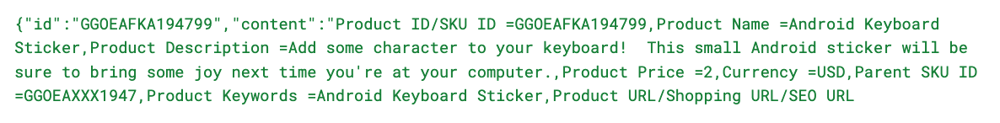
* Each row in file gms-product-image-embeddings.json has an id for the product ID, content for the product name and embedding for the embedding vector of the product image in 512 dimensions. A sample row from the file is as follows (where the embedding vector shows only 3 of the 512 dimensions):
  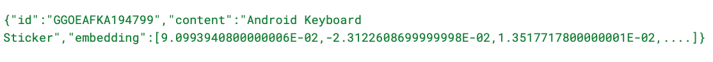

The embeddings for the product data are text based embeddings generated using [Vertex AI Embeddings for Text](https://cloud.google.com/vertex-ai/docs/generative-ai/embeddings/get-text-embeddings) through [Text Embeddings Invoker](https://cloud.google.com/solutions/sap/docs/abap-sdk/vertex-ai-sdk/latest/generate-embeddings#generate_text_embeddings) module of Vertex AI SDK for ABAP.

The embeddings for the product images are multimodal embeddings generated using [Vertex AI Embeddings for Multimodal Data](https://cloud.google.com/vertex-ai/generative-ai/docs/embeddings/get-multimodal-embeddings) through [Multimodal Embeddings Invoker](https://cloud.google.com/solutions/sap/docs/abap-sdk/vertex-ai-sdk/latest/generate-embeddings#generate_image_embeddings) module of Vertex AI SDK for ABAP.

## Setup Vertex AI artifacts

### Upload embeddings to Google Cloud Storage buckets
Download the embedding files for product and product image from the folder [here](../product-embeddings/) to your local desktop. Create two Google Cloud Storage buckets and place each embedding file in each bucket.
* Create bucket gms-product-data-embeddings and place [gms-product-data-embeddings.json](../product-embeddings/gms-product-data-embeddings.json) in it.
  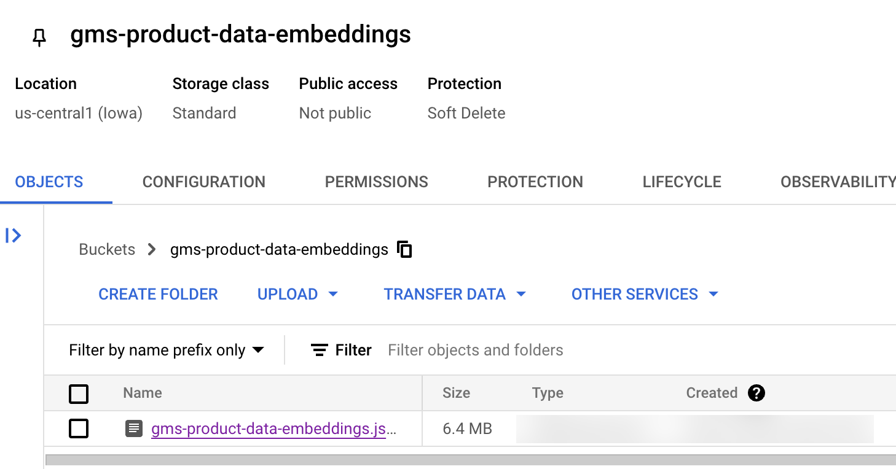
* Create bucket gms-product-image-embeddings and place [gms-product-image-embeddings.json](../product-embeddings/gms-product-image-embeddings.json) in it.
  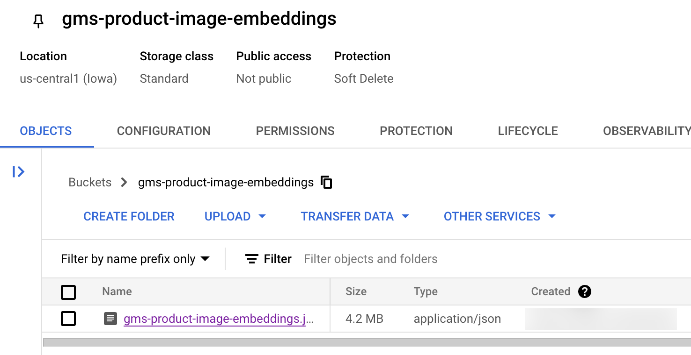

**Note:** Create the GCS buckets in the same Google Cloud Location and Region in which you would create and deploy your vector indices in.

### Create and deploy Vector Index to an Index Endpoint
Create two Vector Indices giving GCS URIs of product and product image buckets and deploy the indices to index endpoint. You can create and deploy the index directly from the cloud console or refer to [this](https://cloud.google.com/solutions/sap/docs/abap-sdk/vertex-ai-sdk/latest/use-vector-search#create-manage-vector-index) link if you would like to do it programmatically using Vertex AI SDK for ABAP.
* “gms-product-data” is deployed with product data embeddings from gms-product-data-embeddings.json.
* “gms-product-image” is deployed with product image embeddings from gms-product-image-embeddings.json.

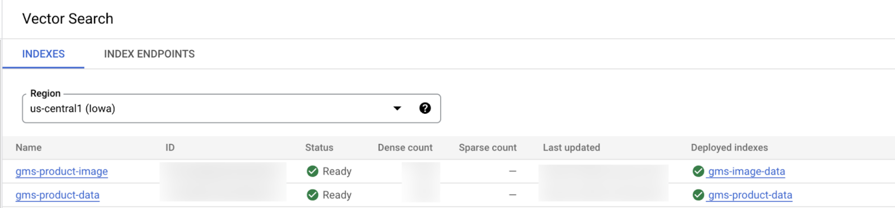

## Setup SDK configurations

### ABAP SDK Client Key setup
Create client keys configurations in table /GOOG/CLIENT_KEY to connect to Vertex AI. Execute the transaction code /GOOG/SDK_IMG and navigate to **ABAP SDK for Google Cloud > Basic Settings > Configure Client Key**.
* Create client key to invoke text and multimodal embedding models, for example "DEMO_AIPLATFORM".
* Create client key to invoke Vector Search on product data, for example "GMS_PRODUCT".
* Create client key to invoke Vector Search on product image data, for example "GMS_IMAGE".

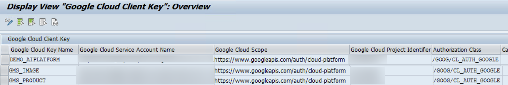

### Create RFCs and configure ABAP SDK service mapping
You need to create an RFC destination for the deployed index endpoints to which you have deployed your indices having your product and image embeddings. Execute the transaction code /GOOG/SDK_IMG and navigate to **ABAP SDK for Google Cloud > Basic Settings > Configure Service Map**. Refer to this [link](https://cloud.google.com/solutions/sap/docs/abap-sdk/vertex-ai-sdk/latest/use-vector-search#create_an_rfc_destination) do create RFCs and configure the same against the client keys in service mapping table /GOOG/SERVIC_MAP.

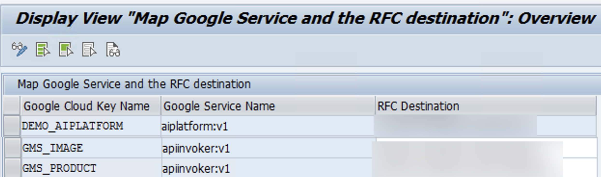

### Configure Embeddings model generation parameters
Configue text and multimodal embedding model ids in table /GOOG/AI_CONFIG. Execute the transaction code /GOOG/SDK_IMG and navigate to **ABAP SDK for Google Cloud > Basic Settings > Vertex AI SDK: Configure Model Generation Parameters**. Refer to this [link](https://cloud.google.com/solutions/sap/docs/abap-sdk/vertex-ai-sdk/latest/install-configure-vertex-ai-sdk-abap#configure-model-generation-parameters).

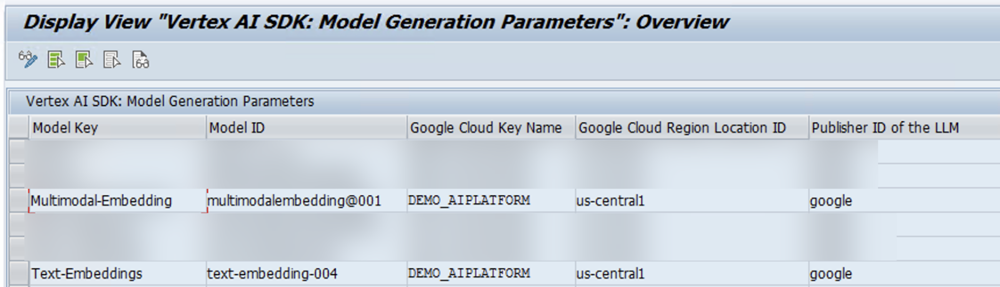

### Configure Vector Search parameters
Configure vector search parameters in table /GOOG/SEARCHCONF based on the deployed id of the indices and client keys. Execute the transaction code /GOOG/SDK_IMG and navigate to **ABAP SDK for Google Cloud > Basic Settings > Vertex AI SDK: Configure Vector Search Parameters**. Refer to this [link](https://cloud.google.com/solutions/sap/docs/abap-sdk/vertex-ai-sdk/latest/install-configure-vertex-ai-sdk-abap#configure-vector-search-parameters).

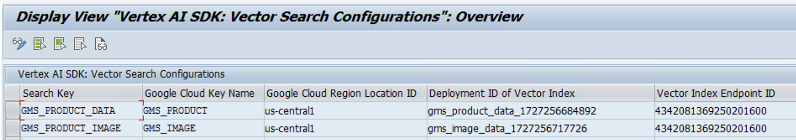

## Invoke Vector Search with Vertex AI SDK for ABAP

### Semantic search on text dataset using text prompts
In this section we would see how to perform semantic search on text based product data using text based prompt or search query. Let’s execute a search query to find Google pens which have prices less than 3 USD. This data is indexed in the form of text embeddings and the search key “GMS_PRODUCT_DATA” is configured to look up the product data. To query this using a simple search string “Google Pens < 3 USD”,
* Use the search key “GMS_PRODUCT_DATA” to instantiate Vector Search invoker class /GOOG/CL_VECTOR_SEARCH.
* Call method FIND_NEIGHBORS_BY_STRING by passing,
  * Search string “Google Pens < 3 USD” under IV_SEARCH_STRING,
  * Embeddings dimension to convert the search string as 768 under IV_EMBEDDINGS_DIMENSIONS,
  * Model key as the text embeddings model key “Text-Embeddings” configured in model generation parameters under IV_EMBEDDINGS_MODEL_KEY.
  * Number of closest matches to return as 5 under IV_NEIGHBOR_COUNT, you can change this to any other integer number based on how many closest matches you would like to retrieve for the search query.
  * Chain the method call GET_NEAREST_NEIGHBORS to get the closest matches for the search query.
 
```java
DATA lv_search_string  TYPE string.

lv_search_string = 'Google Pens < 3 USD'.

TRY.
    DATA(lo_vector_search) = NEW /goog/cl_vector_search( iv_search_key  = 'GMS_PRODUCT_DATA' ).
    DATA(lt_vector_search_response) = lo_vector_search->find_neighbors_by_string( 
                                                          iv_search_string         = lv_search_string
                                                          iv_embeddings_dimensions = 768
                                                          iv_embeddings_model_key  = 'Text-Embeddings'
                                                          iv_neighbor_count        = 5
                                                     )->get_nearest_neighbors( ).
    cl_demo_output=>display( lt_vector_search_response ).
  CATCH /goog/cx_sdk INTO DATA(lo_cx_sdk).
    cl_demo_output=>display( 'Search not successful.' && lo_cx_sdk->get_text( ) ).

ENDTRY.
```
Once executed, 5 closest product matches are returned back.
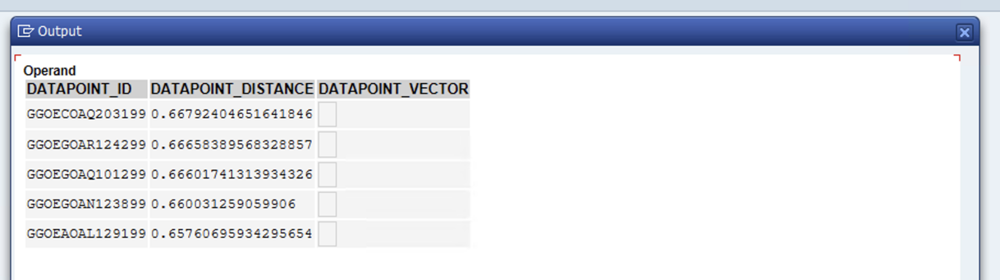

Below are the returned products for the query “Google Pens < 3 USD”.
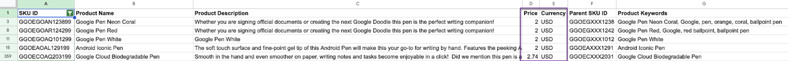

### Semantic search on images using text prompts
In this section we would see how to perform semantic search on product images using text based prompt or search query. Let’s execute a search query to find Google products which have the word “Google” written on them. This data is indexed in the form of multimodal embeddings and the search key “GMS_PRODUCT_IMAGE” is configured to look up the product image data. To query this using a simple search string “items related to dinosaur theme”,
* Use the search key “GMS_PRODUCT_IMAGE” to instantiate Vector Search invoker class /GOOG/CL_VECTOR_SEARCH.
* Call method FIND_NEIGHBORS_BY_STRING by passing,
    * Search string “Google written items” under IV_SEARCH_STRING,
    * Embeddings dimension to convert the search string as 512 under IV_EMBEDDINGS_DIMENSIONS,
    * Model key as the text embeddings model key “Text-Embeddings” configured in model generation parameters under IV_EMBEDDINGS_MODEL_KEY.
    * Number of closest matches to return as 5 under IV_NEIGHBOR_COUNT, you can change this to any other integer number based on how many closest matches you would like to retrieve for the search query.
    * Chain the method call GET_NEAREST_NEIGHBORS to get the closest matches for the search query.

```java
DATA lv_search_string TYPE string.

lv_search_string = 'Google written items'.

TRY.
    DATA(lo_vector_search) = NEW /goog/cl_vector_search( iv_search_key  = 'GMS_PRODUCT_IMAGE' ).
    DATA(lt_vector_search_response) = lo_vector_search->find_neighbors_by_string( 
                                                          iv_search_string         = lv_search_string
                                                          iv_embeddings_dimensions = 512
                                                          iv_embeddings_model_key  = 'Text-Embeddings'
                                                          iv_neighbor_count        = 5
                                                     )->get_nearest_neighbors( ).
    cl_demo_output=>display( lt_vector_search_response ).
  CATCH /goog/cx_sdk INTO DATA(lo_cx_sdk).
    cl_demo_output=>display( 'Search not successful.' && lo_cx_sdk->get_text( ) ).


ENDTRY.
```
Once executed, 5 closest product matches are returned back.
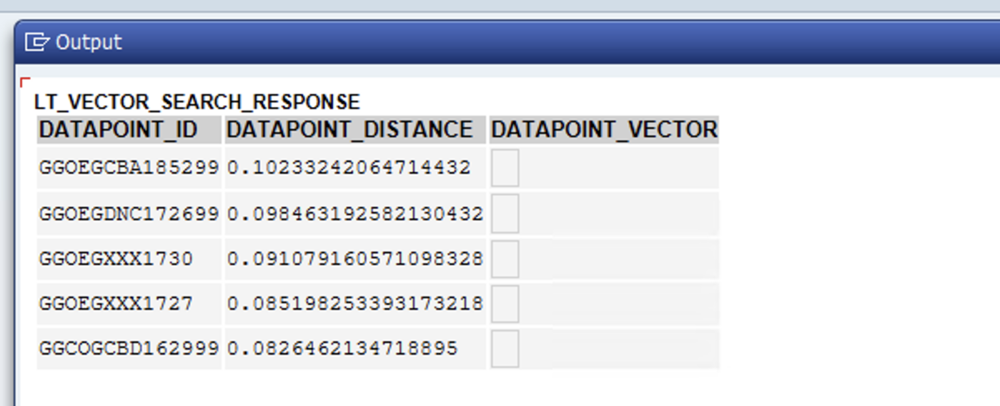

Below are the returned products for the query “Google written items”.
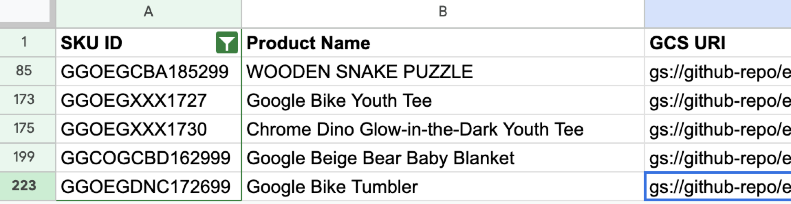

<table>
    <thead>
        <tr>
            <th>Product ID</th>
            <th>Product Image</th>
        </tr>
    </thead>
    <tbody>
        <tr>
            <td>GGOEGCBA185299</td>
            <td>https://storage.googleapis.com/github-repo/embeddings/getting_started_embeddings/gms_images/GGOEGCBA185299.jpg</td>
        </tr>
        <tr>
            <td>GGOEGXXX1727</td>
            <td>https://storage.googleapis.com/github-repo/embeddings/getting_started_embeddings/gms_images/GGOEGXXX1727.jpg</td>
        </tr>
        <tr>
            <td>GGOEGXXX1730</td>
            <td>https://storage.googleapis.com/github-repo/embeddings/getting_started_embeddings/gms_images/GGOEGXXX1730.jpg</td>
        </tr>
        <tr>
            <td>GGCOGCBD162999</td>
            <td>https://storage.googleapis.com/github-repo/embeddings/getting_started_embeddings/gms_images/GGCOGCBD162999.jpg</td>
        </tr>
        <tr>
            <td>GGOEGDNC172699</td>
            <td>https://storage.googleapis.com/github-repo/embeddings/getting_started_embeddings/gms_images/GGOEGDNC172699.jpg</td>
        </tr>
    </tbody>
</table>

### Semantic search on images using image prompts
In this section we would see how to perform semantic search on product images using an image. Let’s execute a search query to find Google notebooks by querying through a [notebook image](https://storage.googleapis.com/github-repo/embeddings/getting_started_embeddings/gms_images/GGOEGOCJ190899.jpg). The product image data is indexed in the form of multimodal embeddings and the search key “GMS_PRODUCT_IMAGE” is configured to look up the product image data. To query using the [notebook image](https://storage.googleapis.com/github-repo/embeddings/getting_started_embeddings/gms_images/GGOEGOCJ190899.jpg),
* Use the search key “GMS_PRODUCT_IMAGE” to instantiate Vector Search invoker class /GOOG/CL_VECTOR_SEARCH.
* Use the model key “Multimodal-Embedding” to instantiate Embeddings invoker class /GOOG/CL_EMBEDDINGS_MODEL.
* Call method GEN_IMAGE_EMBEDDING by passing,
    * GCS uri of notebook image under IV_IMAGE,
    * Embeddings dimension to convert the image into embeddings as 512 under IV_DIMENSION.
    * Chain the method call GET_VECTOR to get the embeddings for the [notebook image](https://storage.googleapis.com/github-repo/embeddings/getting_started_embeddings/gms_images/GGOEGOCJ190899.jpg).
* Call method FIND_NEIGHBORS_BY_EMBEDDING by passing,
    * Number of closest matches to return as 5 under IV_NEIGHBOR_COUNT, you can change this to any other integer number based on how many closest matches you would like to retrieve for the searched image.
    * Image embeddings generated in the above step under IT_EMBEDDINGS,
    * Chain the method call GET_NEAREST_NEIGHBORS to get the closest matches for the search query.

```java
DATA lv_search_string TYPE string,
DATA ls_image TYPE /goog/cl_embeddings_model=>ty_image.

TRY.
    DATA(lo_vector_search) = NEW /goog/cl_vector_search( iv_search_key  = 'GMS_PRODUCT_IMAGE' ).
    DATA(lo_embeddings_model) = NEW /goog/cl_embeddings_model( 
                                      iv_model_key  = 'Multimodal-Embedding' ).

    ls_image-gcs_uri = 'gs://github-repo/embeddings/getting_started_embeddings/gms_images/GGOEGOCJ190899.jpg'.
        
    DATA(lt_embeddings) = lo_embeddings_model->gen_image_embeddings( iv_image     = ls_image
                                                                     iv_dimension = 512
                                            )->get_vector( ).
    DATA(lt_vector_search_response) = lo_vector_search->find_neighbors_by_embedding( 
                                                          iv_neighbor_count = 5
                                                          it_embeddings     = lt_embeddings
                                                     )->get_nearest_neighbors( ).
    cl_demo_output=>display( lt_vector_search_response ).
  CATCH /goog/cx_sdk INTO DATA(lo_cx_sdk).
    cl_demo_output=>display( 'Search not successful.' && lo_cx_sdk->get_text( ) ).


ENDTRY.
```

Once executed, 5 closest product image matches are returned back.
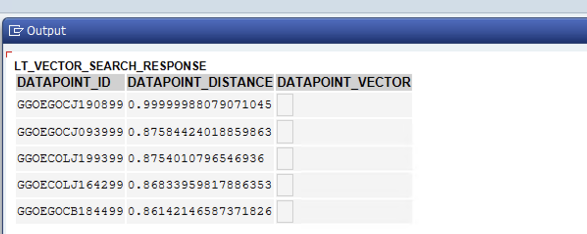

Below are the returned products for the query with the [notebook image](https://storage.googleapis.com/github-repo/embeddings/getting_started_embeddings/gms_images/GGOEGOCJ190899.jpg).
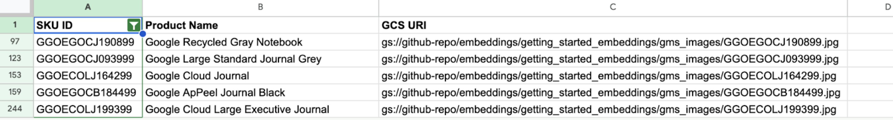

<table>
    <thead>
        <tr>
            <th>Product ID</th>
            <th>Product Image</th>
        </tr>
    </thead>
    <tbody>
        <tr>
            <td>GGOEGOCJ190899</td>
            <td>https://storage.googleapis.com/github-repo/embeddings/getting_started_embeddings/gms_images/GGOEGOCJ190899.jpg</td>
        </tr>
        <tr>
            <td>GGOEGOCJ093999</td>
            <td>https://storage.googleapis.com/github-repo/embeddings/getting_started_embeddings/gms_images/GGOEGOCJ093999.jpg</td>
        </tr>
        <tr>
            <td>GGOECOLJ199399</td>
            <td>https://storage.googleapis.com/github-repo/embeddings/getting_started_embeddings/gms_images/GGOECOLJ199399.jpg</td>
        </tr>
        <tr>
            <td>GGOECOLJ164299</td>
            <td>https://storage.googleapis.com/github-repo/embeddings/getting_started_embeddings/gms_images/GGOECOLJ164299.jpg</td>
        </tr>
        <tr>
            <td>GGOEGOCB184499</td>
            <td>https://storage.googleapis.com/github-repo/embeddings/getting_started_embeddings/gms_images/GGOEGOCB184499.jpg</td>
        </tr>
    </tbody>
</table>

### Semantic search using an enterprise Entity ID
It can also be a requirement for SAP use cases to look up similar enterprise entities like find similar products if a particular product is out of stock. In this section we would see how to perform semantic search using an enterprise entity id. Let’s execute a search query to find products similar to product id “GGOEAFKA194799” in the indexed product data. This data is indexed in the form of text embeddings and the search key “GMS_PRODUCT_DATA” is configured to look up the product data. To query this based on product id,
* Use the search key “GMS_PRODUCT_DATA” to instantiate Vector Search invoker class /GOOG/CL_VECTOR_SEARCH.
* Call method FIND_NEIGHBORS_BY_ENTITY_ID by passing,
    * Pass the product id “GGOEGOKA209399” under IV_ENTITY_ID,
    * Chain the method call GET_NEAREST_NEIGHBOR to get the match for the searched product,
    * You can also call the method GET_NEAREST_NEIGHBORS instead to get the closest matches for the product “GGOEGOKA209399” by additionally passing the number of matches to return under IV_NEIGHBOR_COUNT.
 
```java
TRY.
    DATA(lo_vector_search) = NEW /goog/cl_vector_search( iv_search_key  = 'GMS_PRODUCT_DATA' ).
    DATA(lt_vector_search_response) = lo_vector_search->find_neighbors_by_entity_id(       
                                                          iv_entity_id = 'GGOEAFKA194799'
                                                     )->get_nearest_neighbors( ).
    cl_demo_output=>display( lt_vector_search_response ).
  CATCH /goog/cx_sdk INTO DATA(lo_cx_sdk).
    cl_demo_output=>display( 'Search not successful.' && lo_cx_sdk->get_text( ) ).

ENDTRY.
```

Once executed, similar products are returned back as search results. The method throws an error if the searched entity id is not present in the index.
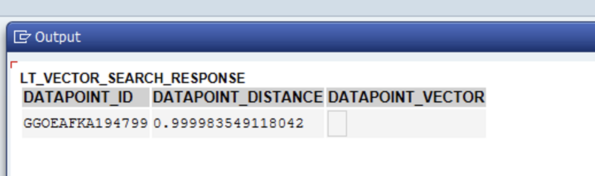

## What’s next
* This [github sample](https://github.com/GoogleCloudPlatform/google-cloud-abap/tree/main/abap-sdk/ZGOOG_SDK_RECIPES/zgoog_sdk_vector_search_recipe) shows an end-to-end example of this recipe guide.  
* If you need help resolving problems with the ABAP SDK for Google Cloud, then do the following:
    * Refer to the [ABAP SDK for Google Cloud troubleshooting guide](https://cloud.google.com/solutions/sap/docs/abap-sdk/on-premises-or-any-cloud/latest/troubleshooting).
    * Ask your questions and discuss ABAP SDK for Google Cloud with the community on [Cloud Forums](https://www.googlecloudcommunity.com/gc/forums/filteredbylabelpage/board-id/cloud-developer-tools/label-name/abap%20sdk).
    * Collect all available diagnostic information and contact Cloud Customer Care. For information about contacting Customer Care, see Getting support for [SAP on Google Cloud](https://cloud.google.com/solutions/sap/docs/getting-support).


