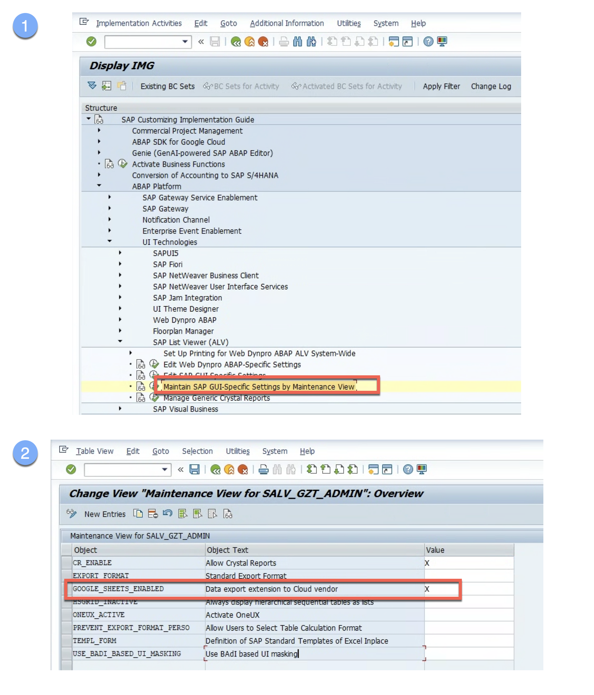

ALV Export to Google drive as a sheet
----------------------------------------
This utility exports SAP ALV data directly to Google Drive. It leverages the SAP Badi SALV_JPB_BADI_DATA_PUBLISHER for seamless integration and OAuth 2.0 for secure authentication.  The target Drive ID is configurable via SPA/GPA parameter ZGOOG_DRIVE_ID in transaction SU3. 

### Prerequisite Configurations

Before you implement and use this utility, make sure that you or your administrators have completed the following prerequisites:

-   You have a Google Cloud account and project. Please keep the Project Id with you which is available in Google Cloud [Dashboard](https://console.cloud.google.com/home/dashboard).

-   Billing is enabled for your project. [See how to confirm that billing is enabled for your project](https://cloud.google.com/billing/docs/how-to/verify-billing-enabled).

-   Google Drive is enabled for your GCP project.

-   Your SAP system supports OAuth 2.0 and you have imported the OAuth extension TR along with the SDK product TR as per [installation guidelines](https://cloud.google.com/solutions/sap/docs/abap-sdk/latest/install-config#install_the).

-   You have followed the [authentication setup guidelines](https://cloud.google.com/solutions/sap/docs/abap-sdk/latest/authentication#oauth_with_client_credentials) on Google Cloud console for your GCP project to,

    -   [Create OAuth 2.0 Consent](https://cloud.google.com/solutions/sap/docs/abap-sdk/latest/authentication#oauth_config_consent),

    -   [Create OAuth 2.0 Client ID credentials](https://cloud.google.com/solutions/sap/docs/abap-sdk/latest/authentication#oauth_create_credentials),

    -   [Create OAuth 2.0 Client Profile](https://cloud.google.com/solutions/sap/docs/abap-sdk/latest/authentication#oauth_setup_client_profile),

    -   [Configure OAuth 2.0 Client](https://cloud.google.com/solutions/sap/docs/abap-sdk/latest/authentication#oauth_configure_client),

    -   [Request OAuth 2.0 request token](https://cloud.google.com/solutions/sap/docs/abap-sdk/latest/authentication#oauth_request_token).

-   You have authorization to access the Sheet scope for your ID.

### Configure client key and OAuth profile

Create a client key with the OAuth 2.0 authentication class "/GOOG/CL_OAUTH_GOOGLE" and configured OAuth 2.0 profile for Drive API as per guidelines [here](https://cloud.google.com/solutions/sap/docs/abap-sdk/latest/authentication#oauth_configure_client_key).

Below is a client key which we would be using in the quick start.

Below is the OAuth profile with Drive scopes.

### Implement the solution
You can implement the solution by cloning the repo into your SAP system or manually creating the BADI implementation zei_salv_google_sheets_publush with [code sample](zcl_salv_google_sheets_publush.clas.abap)

### Customizing
You need to enable Google export in your ALV instances by going to transaction SPRO and executing Maintain SAP GUI-Specific Settings under node SAP List Viewer (ALV).

Each user must configure a Google Drive ID in SPA/GPA parameter ZGOOG_DRIVE_ID by using Transaction Code SU3.

### Using the solution 
After completing all configuration steps, you can now use the export to Google Sheets option in ALV

