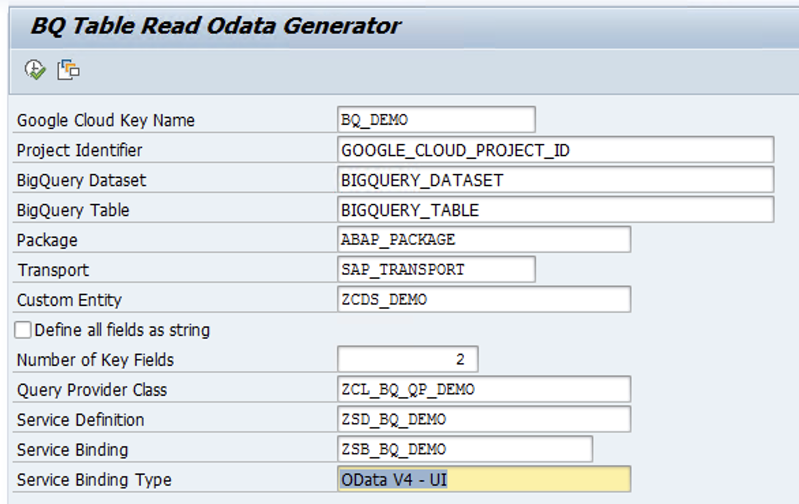

BigQuery Table Read : RAP Odata service generator sample utility
----------------------------------------
This sample utility can be used to generate RAP Odata service for reading entries from a BigQuery table or view. The utility will generate the following:
- A custom entity with all the fields of the BigQuery table with appropriate types
- A query provider class that will dynamically select entries from BigQuery for the filter conditition
- Service Definition for the custom entity
- Service Binding for the Service Defition

The generated Service Binding can be used as an Odata service for Fiori or other applications to read data from BigQuery 

### Prerequisite Configurations

Before you implement and use this utility, make sure that you or your administrators have completed the following prerequisites:

-   You have a Google Cloud account and project. Please keep the Project Id with you which is available in Google Cloud [Dashboard](https://console.cloud.google.com/home/dashboard).

-   Billing is enabled for your project. [See how to confirm that billing is enabled for your project](https://cloud.google.com/billing/docs/how-to/verify-billing-enabled).

-   BigQuery API is enabled for your GCP project.

- Follow the [Authentication guide](https://cloud.google.com/solutions/sap/docs/abap-sdk/on-premises-or-any-cloud/latest/authentication) to set up a service account (say abap-sdk-qs@PROJECT_ID.iam.gserviceaccount.com) and grant appropriate permissions.
### Configure client key for BigQuery Access

The below configuration will be used by the ABAP SDK to connect to the BigQuery V2 API.
 
Goto SPRO > ABAP SDK for Google Cloud > Basic Settings > Configure Client Key and add the following new entry. (Replace the string PROJECT_ID with your Google Cloud project Id)

| Field Name                             | Value         |
| ------------------------------------   | ------------- |
| **Google Cloud Key Name:**             | DEMO_BQ |
| **Google Cloud Service Account Name:** | abap-sdk-qs@PROJECT_ID.iam.gserviceaccount.com |
| **Google Cloud Scope:**                | https://www.googleapis.com/auth/cloud-platform |
| **Google Cloud Project Identifier:**   | PROJECT_ID |
| **Authorization Class:**               | /GOOG/CL_AUTH_GOOGLE |

**NOTE** Leave the other fields blank

*  Validate the configuration 'DEMO_BQ' using SPRO > ABAP SDK for Google Cloud > Utilities > Validate Authentication Configuration.

### Run the utility 
Run Program ZR_BQ_TABLE_READ_ODATA_GEN using transaction SE38 to generate RAP Odata service by populating the following fields

| Selection Screen Field                 | Value         |
| ------------------------------------   | ------------- |
| **Google Cloud Key Name**              | Client Key Name set up in the previous step |
| **Project Identifie**                  | Google Cloud Project Id where BigQuery Data exists |
| **BigQuery Dataset**                   | BigQuery Dataset |
| **BigQuery Table**                     | BigQuery table or view |
| **Package**                            | SAP Package where objects will be saved
| **Transport**                          | SAP Transport request
| **Custom Entity**                      | Name of the custom entity to be generated 
| **Define all fields as string**        | Optional, If enabled, all fields of custom entity will be set as String type
| **Number of Key Fields**               | Leading number of fields of the custom entity to be set as key fields 
| **Query Provider Class**               | Class name to be generaed that will serve as the query provider for Custom entity
| **Service Definition**                 | Service Defintion name to be generated
| **Service Binding**                    | Service Binding name to be generated
| **Service Binding Type**               | One of the values of constant ZCL_BQ_TABLE_READ_ODATA_GEN=>C_SRVB_BIND_TYPE

If successfully run, all the RAP objects will be generated. 

### Use Service Binding
The generated Service Binding can now be activated using transaction /IWFND/V4_ADMIN and then used in your applications the same way you would use any RAP Odata service