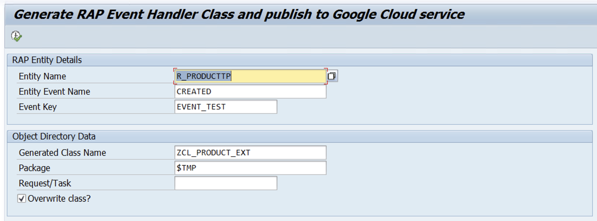

# Business Eventing Toolkit for SAP Utilities

## Business Eventing Toolkit

This toolkit facilitates the integration between SAP business events and Google Cloud, enabling seamless event publishing from SAP systems.

### Overview

The primary goal of this toolkit is to simplify the process of capturing business events triggered within the SAP landscape and publishing them reliably to Google Cloud. By doing so, it enables:

* **Real-time Integration:** React to business moments in SAP almost instantly within Google Cloud services.
* **Decoupling:** Loosely couple SAP processes from downstream consumers, enhancing system resilience and flexibility.
* **Extensibility:** Build event-driven architectures where various Google Cloud services (like Cloud Functions, Cloud Run, Pub/Sub, FCM and Integration Connectors) or third-party applications can subscribe to and react to SAP events.

The toolkit ensures that events are published in a standardized format, adhering to the **CloudEvents specification (v1.0)**. This promotes interoperability and simplifies event consumption across different platforms and services.

### RAP Event Handler Generator

A key component of this toolkit is the **RAP Event Handler Generator** (Program: `ZGOOG_R_GEN_RAP_EVTHANDLER`).

#### Purpose

This tool automates the creation of the necessary ABAP OO Class required to handle specific RAP business entity events (e.g., `CREATED`, `UPDATED`, `DELETED`).

#### How to Use

1.  **Run the Generator Program:** Execute the ABAP program `ZGOOG_R_GEN_RAP_EVTHANDLER`.
2.  **Provide Details:**
    * Specify the target **RAP Entity Name** (e.g., `R_PRODUCTTP`).
    * Enter the specific **Entity Event Name** you want to capture (e.g., `CREATED`).
    * Define an **Event Key** (this key is used by the publisher to identify the event configuration, like the target Pub/Sub topic).
    * Provide necessary **Object Directory Data** (Package, Request/Task).
    * Specify the desired **Generated Class Name**.

3.  **Execute:** Run the program.

#### Outcome

The generator creates an ABAP class containing:
* A local handler class inheriting from `cl_abap_behavior_event_handler`.
* A method implementation for the specified RAP entity event.
* Pre-written code within the event handler method to:
    * Serialize the event data using `/goog/cl_json=>serialize`.
    * Publish the event to Google Cloud Pub/Sub using `/goog/cl_event_publisher=>publish_event` with the specified `event_key`.

This generated class can then be activated and used within the RAP Business Object's Behavior Definition to automatically publish events when the corresponding actions occur in SAP.

---

### Configure Outbound IDoc Events

The Business Eventing Toolkit for SAP allows you to send **Outbound IDoc events** to Google Cloud targets. This section explains how to configure an event listener for IDoc events and how to integrate a custom function module for publishing these events.

#### 1. Configure IDoc Event Listener for the Event Key

First, you need to map an event listener in the Business Eventing Toolkit to an **Event Key**. This Event Key will be associated with the Google Cloud target where your IDoc events will be sent.

1.  In SAP GUI, execute the transaction code `/GOOG/SDK_IMG`.
    *Alternatively, execute transaction code `SPRO`, then navigate to **SAP Reference IMG > ABAP SDK for Google Cloud > Basic Settings > Business Eventing: Configure Event Listeners for IDOC**.*
2.  Click **New Entries**.
3.  Enter values for the following fields:

| Field Name                  | Data Type | Description                                                                                                                                                                                                                                                                                            |
| :-------------------------- | :-------- | :----------------------------------------------------------------------------------------------------------------------------------------------------------------------------------------------------------------------------------------------------------------------------------------------------- |
| **Basic Type** | `CHAR`      | The name of the IDoc basic type for which you want to send events to Google Cloud (e.g., `MATMAS05`).                                                                                                                                                                                                  |
| **IDoc Direction** | `CHAR`      | The direction of the IDoc: `Outbound` (since we are focusing on outbound `OWN_FUNCTION` here).                                                                                                                                                                                                         |
| **Event Key** | `CHAR`      | The name of the publisher event configuration, which you must have previously maintained in the "Configure target Google Cloud services" section of the Business Eventing Toolkit configuration. This links your IDoc event to a specific Google Cloud target. |
| **Event Processor Class** | `CHAR`      | (Optional) The name of a custom processor class containing additional logic to populate the event body or extend Cloud Event attributes. This class must implement the interface `/GOOG/IF_IDOC_EVT_DATA_HANDLER`.                                                                                                                                                                                                                                                                                                         |

**Note:** For the `Event Processor Class`, you can implement custom logic to transform the IDoc data into the desired payload structure for your Cloud Event. Refer to the Business Eventing Toolkit documentation for details on extending the processor class.

#### 2. Configure SAP for Outbound IDoc Processing using a Custom Function Module (`OWN_FUNCTION` based)

Once the IDoc event listener is configured, you need to set up the standard SAP IDoc framework to use your custom function module (like `zfm_idoc_own_function`) to publish the outbound IDocs.

**Prerequisites:**

* Your custom function module (e.g., `Z_IDOC_OWN_FUNCTION`) based on the standard SAP `OWN_FUNCTION` template is created and activated in transaction `SE37`.
    * We provides a sample implementation: `Z_IDOC_OWN_FUNCTION`. Customers can directly configure this function module or use it as a sample to build their own custom logic.
    * You can find the sample here: [zfm_idoc_own_function.abap](https://github.com/GoogleCloudPlatform/google-cloud-abap/blob/main/abap-sdk/ZGOOG_SDK_UTILITIES/zgoog_business_evt_toolkit/src/zfg_eventing_utility.fugr.zfm_idoc_own_function.abap)
* The IDoc basic type (`WE30`) and message type (`WE81`) are defined and linked (`WE82`).
* A logical system for the receiving partner has been defined (`BD54`).

Follow these steps in your SAP system:

##### 2.1. Define an ABAP-PI Port (Transaction `WE21`)

This step defines how the IDoc data will be technically transmitted out of SAP by calling your custom function module.

1.  Go to transaction code `WE21`.
2.  In the navigation tree, expand **Ports** and select **ABAP-PI** (ABAP Programming Interface).
3.  Click the **Create** button.
4.  Enter a **Port Name** (e.g., `Z_IDOC_BE_PORT`) and a descriptive **Description**.
5.  In the **Function module** field, enter the name of your custom function module (e.g., `zfm_idoc_own_function`). This is the crucial link.
6.  Save your entry.

##### 2.2. Define an Outbound Process Code (Transaction `WE41`)

A process code links a message type to the function module that will process the outbound IDoc.

1.  Go to transaction code `WE41`.
2.  Click **New Entries**.
3.  Enter a **Process Code** (e.g., `ZMAT_BE` for MATMAS Business Event).
4.  Enter a **Description**.
5.  Select the **Outbound type** as `F` (Function Module).
6.  On the **Processing with function module** tab, verify that your custom function module name (e.g., `zfm_idoc_own_function`) is correctly displayed. If not, enter it.
7.  Save your entry.

##### 2.3. Configure Partner Profile (Transaction `WE20`)

The partner profile defines the parameters for exchanging IDoc data with a specific partner (logical system) for a given message type.

1.  Go to transaction code `WE20`.
2.  Select **Partner Type LS** (Logical System).
3.  Find or create your **Partner No.** (the logical system name of the receiving system that SAP will send IDocs to, e.g., the logical system representing your Google Cloud integration).
4.  Under the **Outbound parameters** section, click the **Create outbound parameter** button (a small icon with a plus sign).
5.  Enter the following details:
    * **Message Type:** Your IDoc message type (e.g., `MATMAS`).
    * **Receiver Port:** The port you created in `WE21` (e.g., `Z_IDOC_BE_PORT`).
    * **Basic Type:** Your IDoc basic type (e.g., `MATMAS05`).
    * **Process Code:** The process code you created in `WE41` (e.g., `ZMAT_BE`).
    * On the **Outbound Options** tab:
        * **Output Mode:** Select **Pass IDoc Immediately** or **Collect IDocs** based on your processing requirements.
        * If `Pass IDoc Immediately` is chosen, ensure the **Transfer IDoc immediately** checkbox is selected.
6.  Save your entries.

After completing these configuration steps, when an outbound IDoc is generated for the specified message type and partner, SAP's IDoc processing framework will trigger your custom function module (`zfm_idoc_own_function`). This module, in turn, will leverage the Business Eventing Toolkit to publish the IDoc event to your configured Google Cloud target.
