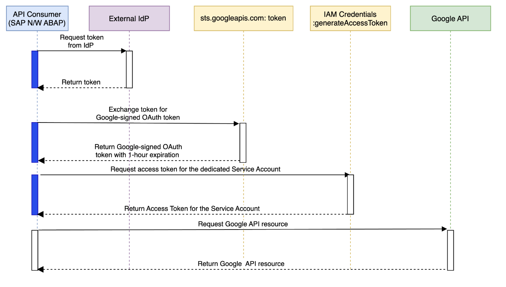

Workload Identity Federation in ABAP SDK
----------------------------------------
Workload Identity Federation (WIF) is an authentication method that can be used in ABAP SDK if your SAP workloads are not running on Google Cloud. You can use WIF with Amazon Web Services (AWS), or with any identity provider (IdP) that supports OpenID Connect (OIDC), such as Microsoft Azure, or SAML 2.0. You can use WIF as an alternative to authenticating with [Service Account Key](https://cloud.google.com/solutions/sap/docs/abap-sdk/latest/authentication#externally_hosted_use_token). You can set up WIF in ABAP SDK versions 1.5 and above

The diagram below illustrates the process of token exchange in WIF.

To configure and use WIF in ABAP SDK, you need to complete the following steps in your external IdP, Google Cloud project and your SAP landscape:

 - Prepare your external IdP
 - Configure WIF in Google Cloud
 - Implement code to retrieve a token from your IdP, which will be passed to Security Token Service.
 - Configure WIF in ABAP SDK Client Key

### Prepare your external IdP

You need to configure your IdP so that your SAP workload can obtain credentials that can be exchanged for a Google OAuth 2.0 security token. The configuration steps depend on your IdP. If you are using other Hyperscalers as your IdP, follow these [steps](https://cloud.google.com/iam/docs/workload-identity-federation-with-other-clouds). For other IdPs use IdP specific [steps](https://cloud.google.com/iam/docs/workload-identity-federation-with-other-providers#prepare). Make a note of parameter values that were used when configuring your IdP. You’ll need them later when configuring the WIF in Google Cloud. Return to this guide after completing the configuration of your external IdP.

### Configure WIF in Google Cloud

In this step, you will create and configure Workload Identity Pools and Providers in Google Cloud Console. You will configure an Identity Pool, which is an entity that lets you manage external identities. You will also configure a workload identity pool provider, which is an entity that describes a relationship between Google Cloud and your IdP. Configuration steps vary depending on your external IdP. If you are using other Hyperscalers as your IdP, follow these [steps](https://cloud.google.com/iam/docs/workload-identity-federation-with-other-clouds#create_the_workload_identity_pool_and_provider). For other IdPs use IdP specific [steps](https://cloud.google.com/iam/docs/workload-identity-federation-with-other-providers#create_the_workload_identity_pool_and_provider). Make a note of the following values, which will be used later in ABAP SDK Client Key Configuration.

 - PROJECT_NUMBER: the project number of the Google Cloud project that you use to create the workload identity pool.
 - POOL_ID: Unique ID that identifies the workload identity pool.
 - PROVIDER_ID: an ID that identifies the workload identity pool provider.

### Implement Code to retrieve token from your IdP

In this step, you will write ABAP code in your SAP system (where ABAP SDK is installed) to retrieve the token from your IdP.

For ease of implementing WIF, ABAP SDK provides an abstract class /GOOG/CL_AUTH_WIF_BASE which has the logic to retrieve OAuth 2.0 security token from [Security Token Service](https://cloud.google.com/iam/docs/reference/sts/rest) and OAuth 2.0 Access Token from [IAM Service Account Credentials API](https://cloud.google.com/iam/docs/reference/credentials/rest).

As an ABAP developer, you need to create a class in your namespace (for example: Z) that inherits from the abstract class /GOOG/CL_AUTH_WIF_BASE. This class must implement the method GET_EXT_IDP_TOKEN and you need to write logic in that method to get the credential/token from your IdP and populate the following fields:
 - CV_TOKEN - Populate the token retrieved from your IdP in string format.
 - CV_TOKEN_TYPE - Populate the type of token retrieved from your IdP.  Supported values are
   - urn:ietf:params:oauth:token-type:jwt
   - urn:ietf:params:oauth:token-type:id_token
   - urn:ietf:params:aws:token-type:aws4_request
   - urn:ietf:params:oauth:token-type:access_token
   - urn:ietf:params:oauth:token-type:saml2

The values populated in CV_TOKEN and CV_TOKEN_TYPE are then used by methods of the abstract class /GOOG/CL_AUTH_WIF_BASE to exchange and retrieve the final OAuth 2.0 token that will be used for the API Call.

Before implementing WIF, please review the [list of supported Products and limitations](https://cloud.google.com/iam/docs/federated-identity-supported-services).

Attached are the sample implementations for for other Hyperscalers:
 - Azure [code sample](zcl_auth_wif_azure.clas.abap)
 - AWS [code sample](zcl_auth_wif_aws.clas.abap)

### Configure WIF in ABAP SDK Client Key
 - In the SAP GUI, enter transaction code SPRO.
 - Click SAP Reference IMG.
 - Click ABAP SDK for Google Cloud > Basic Settings > Configure Client Key.
 - Click New Entries.
 - Enter values for the following fields:
   - Google Cloud Key Name
   - Google Cloud Project Identifier - Enter PROJECT_NUMBER where the workload identity pool was created. 
   - Authorization Class - Class that your created which contains the implementation of method GET_EXT_IDP_TOKEN. 
   - Authorization Parameter 1 - Provide POOL_ID of workload identity pool.
   - Authorization Parameter 2 - PROVIDER_ID of workload identity pool provider.
 - Save the new entry.
