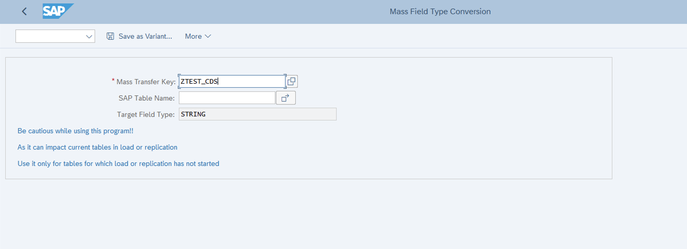

# Convert all target BigQuery table fields to type String 

This utility can be used to convert target data types of all fields to String for tables that are configured in BigQuery Connector for SAP. 

## Prerequisites 
-  You have [set up and configured](https://cloud.google.com/solutions/sap/docs/bq-connector/latest/install-config) BigQuery Connector for SAP in your SAP SLT Landscape
 
-   You have maintained relevant tables in /GOOG/BQ_TABLE using Tcode /GOOG/SLT_SETTINGS

## Solution
-   Create a program in SE38 and paste the [linked](zr_util_mass_convert_field_map.prog.abap) code, which will convert data type of all fields into String (corresponding to the mass transfer id and SAP table name provided in the selection).

-   Note: Apply additional selection, validation and error handling logic as required

-   Execute the program with suitable input parameters

-   If successful, the table modification will be reflected in transaction code /GOOG/SLT_SETTINGS

Example:

-  Table maintained in Tcode /GOOG/SLT_SETTINGS:

-  Executing the report `ZR_UTIL_MASS_CONVERT_FIELD_MAP` with the selection for Mass transfer Key as above
Note :Here I have not provided SAP Table Name explicitly which means all the tables maintained under the Mass transfer key should be picked up by the report. One can also include specific SAP table name(s) as part of selection.

-  Result:

- Changes reflected in Tcode /GOOG/SLT_SETTINGS post execution of the report:

